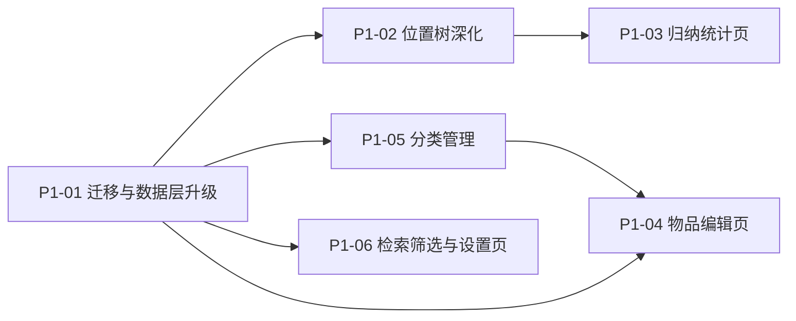

# 收纳助手（Shouna）架构规划 · P1

> 版本：**v1.0** ｜ 上游：[docs/PRD.md](PRD.md) ｜ 前置：[docs/ARCHITECTURE-P0.md](ARCHITECTURE-P0.md)（已落地） ｜ 路径基准：工程根 `shouna/`
> 本页**只描述 P1 的 11 条需求 + 3 项无编号交付项**的实现。P2、V2 **一律不在本页范围**——不规划、不预设方案、不预留代码路径。
> **何时读**：要动 P1 涉及的代码（迁移、位置树增强、统计页、物品编辑页、分类管理、设置页、搜索筛选）时。

**一句话结论**：本次把「**位置树从能用到好用**」补齐——建**首个真实迁移**（`version 1 → 2`）物化 `location.path` 以支撑递归；位置树可移动 / 合并 / 标临时；新增**归纳统计页**、**物品编辑页**（别名 / 数量落地）、**分类管理**、**设置页**；搜索加筛选 chips。

**与 P0 的关系（读前必看）**：P0 已交付「数据不丢 + 位置树 + 状态与可信度 + 拼音检索」，`version = 1`、5 张表、无迁移基建。本页在**同一套分层与同一批仓库接口**上继续扩：**不新增表**，只加 **1 列**（外加索引）；`ItemRepository` / `LocationRepository` / `CategoryRepository` 均为**接口扩展**（新增方法，不改既有签名）。P0 §8.1 与 §8.2 登记给 P1 的 5 项落差（`path` 物化、递归计数、FR-28 入口、FR-22 chips、FR-29 集中清单、详情页折叠区）由本页兑现。

## 0. 关键决策

| 决策点 | 结论 |
|---|---|
| 范围 | **11 条 FR**：FR-04 / 06 / 14 / 21 / 22 / 28 / 29 / 33 / 38 / 44 / 47；另含**无编号 3 项**：别名、数量、物品编辑页（用户 2026-09-29 确认纳入） |
| 存储 | **仍是 5 张表，不新增表**；`version 1 → 2`，只加 `location.path` 一列 + 1 个索引 |
| 迁移 | **本项目首个真实迁移**：`ALTER TABLE` + 递归 CTE 回填（**带 `COALESCE` 兜底**，否则脏数据会让迁移整体失败）+ 建索引；**不启用** `fallbackToDestructiveMigration` |
| `path` 语义 | **ID 序列**（非名称路径）：`/根id/…/自身id/`，含自身、前后带 `/`；子孙查询 = 前缀 `LIKE`。名称路径（面包屑）**仍由父链实时派生**，不入库 |
| 别名 | **启用既有 `item.alias_blob`**（分隔符拼接多个别名），**不建 `item_alias` 表**——守 `prd/08` §7.6 的 A-2（「名称 + 别名」派生的检索键随物品记录持久化） |
| 数量 | **启用既有 `item.quantity`**：仅整数、默认 1、不做单位换算（`prd/11` Q3） |
| 临时位置（FR-06） | 用既有 `location.is_temporary`；**不种子化「待归位区」节点**——「待归位」的主口径是**物品状态** `to_be_put_back`（`prd/09` §8.2.1 的 C-5） |
| 递归口径 | FR-21 计数、FR-28 批量确认、FR-22 位置筛选**一律含子层**，UI 明示影响范围（「含子层共 M 件」） |
| 统计（FR-33） | C-1 只出 **2 块**（物品总数 / 位置总数）；**「存放关系数」块裁掉**（一物一处下该数恒等物品总数） |
| 超期（FR-29） | 复用 `app_config.threshold_months`（默认 6），设置页可改 **3 / 6 / 12** |
| 设置页（FR-47） | **不含「显示完整功能」开关**（用户 2026-09-29 裁示不做，与 P0 §8.1-8「不做阈值门控」一致）；含阈值、分类管理入口、隐私说明、关于 |
| 分类管理（FR-44） | 落点 = **P-SETTINGS 内的入口 → 独立页**（`prd/07` §6.1 未给独立页，本页补一条路由）；内置分类**可改名不可删**，自定义可增删改 |
| 导航 | **5 条 → 9 条**（新增 `Stats` / `ItemEdit` / `Settings` / `CategoryManage`）；统计下钻**不新增路由**，在 P-STATS 页内两态 |
| 任务 | **6 个**（P1-01 ~ P1-06） |

> **`location.path` 为什么值得动一次表**：P0 §8.1-2 已登记「P1 需要时加列 + 一次性迁移到 `version = 2`」。FR-21 的「含子层共 M 件」与 FR-28 的「该位置全部物品」都是**子树范围查询**；不物化则每次构建检索文档都要全树内存递归。物化后查询退化为一次带索引的前缀匹配，代价是移动子树时重写该子树的 `path`（O(子树大小)，位置量为千级，可接受）。

## 1. 范围与需求映射

| 编号 | 需求 | 本页落地形态 | 落点页面 |
|---|---|---|---|
| FR-04 | 位置移动 / 合并 | 子树整棵移动到别处；两个位置合并（B 并入 A，B 删除） | P-BROWSE |
| FR-06 | 临时位置标记 | 位置可标 `is_temporary`；其下物品在列表与统计中带显著标记 | P-BROWSE / P-STATS |
| FR-14 | 录入时重名提醒 | 保存时若存在同名 / 高度相似物品，**非阻塞**提示 + 「查看已有」 | P-ADD |
| FR-21 | 按位置浏览（下钻） | 逐层进入；展示「本层 N 件 / 含子层共 M 件」 | P-BROWSE |
| FR-22 | 搜索筛选 | 结果可按「分类 / 位置 / 状态」筛选，可叠加、可一键清空 | P-SEARCH |
| FR-28 | 按位置批量确认 | 打开某位置时对该位置**含子层**全部物品一键确认 | P-BROWSE |
| FR-29 | 未确认物品提醒 | P-STATS 列出超期未确认清单 + 条数徽标；阈值 3 / 6 / 12 可配 | P-STATS |
| FR-33 | 总览统计卡片 | C-1 两块数字（物品总数 / 位置总数）+ 下钻明细 | P-STATS |
| FR-38 | 待归位清单 | C-5：`to_be_put_back` 与「临时位置」两部分去重合计，可逐条归位 | P-STATS |
| FR-44 | 分类管理 | 内置分类 + 用户自定义增删改；删分类其下物品转「未分类」 | P-SETTINGS → 分类管理页 |
| FR-47 | 设置页 | 阈值配置、分类管理入口、隐私说明、关于；**无「显示完整功能」开关** | P-SETTINGS |
| —（无编号） | 别名 | 多个别名，参与检索；编辑位在 P-ITEM-EDIT | P-ITEM-EDIT |
| —（无编号） | 数量 | 整数、默认 1、无单位；编辑位在 P-ITEM-EDIT | P-ITEM-EDIT |
| —（无编号） | 物品编辑页 | 补全分类 / 别名 / 备注 / 数量；同时是详情页「⋯更多」折叠区的落点 | P-ITEM-EDIT |

> **本次不做**：P2 全部 16 条（FR-08 / 15 / 16 / 17 / 18 / 24 / 30 / 31 / 32 / 34 / 35 / 36 / 37 / 39 / 45 / 49）、V2 全部、统计卡片 C-2 / C-3 / C-6、标签（FR-45）、回收站（FR-49）、拍照 / 扫码 / 语音。**导出 / 导入（FR-40 / 42 / 43）已永久废弃**，本页不实现、不预留（见 `prd/05` §4.11 第 6 项）。

## 2. 分层与数据流

沿用 P0 的分层与约定，本页无结构变化，只有接口与页面增补：

| 层 | 本次变化 |
|---|---|
| 数据源 | 仍 `data/local`；**+1 迁移**（`Migrations.kt`，挂载于 `di/DatabaseModule`）；`LocationEntity` 加 `path`；四个 DAO 扩方法（`ConfigDao` 加可观察读） |
| Repository | 四个仓库**扩展方法**（不改既有签名）：`LocationRepository` 加 `move` / `merge` / `setTemporary` / `observeCounts` / `observeLocationCount`；`ItemRepository` 加 `updateFields`（别名 / 数量 / 备注 / 分类）/ `confirmByLocation` / `findSimilar` / `putBack` / `moveItem` / 三个流；`CategoryRepository` 由**只读扩为可写**；`ConfigRepository` 加 `observeThresholdMonths` / `setThresholdMonths` |
| domain | 新增纯函数：ID 序列 `path` 拼装（`LocationPath.buildIdPath` / `isDescendantPath`）、重名相似度判定；`SearchDoc` 补别名，`StoredItem` 补 `aliases` / `quantity` |
| UI | 新增 **4 页 + 5 组件**（组件：`LocationMoveSheet` / `TemporaryMark` / `StatCard` / `AliasEditor` / `FilterChips`）；`P-BROWSE` 与 `P-ITEM-DETAIL` 补齐 F2 能力 |

**Repository（4 个，均为扩展）**

- `LocationRepository`：既有 `observeTree` / `observeChildren` / `observeItemsIn` / `create` / `rename` / `setNote` / `delete(mode, migrateTargetId)` / `touchLastUsed`；新增 `move(nodeId, newParentId)`、`merge(sourceId, targetId)`、`setTemporary(nodeId, flag)`、`observeCounts(nodeId)`（本层 / 含子层两个数）、`observeLocationCount()`
- `ItemRepository`：新增 `updateFields(itemId, patch)`（分类 / 别名 / 数量 / 备注一张补丁表 `ItemFieldPatch`）、`confirmByLocation(nodeId)`（含子层）、`findSimilar(name)`（FR-14 查重）、`putBack(itemId, locationId)`（C-5 归位）、`moveItem(itemId, locationId)`
- `CategoryRepository`：新增 `create` / `rename` / `delete`
- `ConfigRepository`：P0 只有一次读 `thresholdMonths()`；本次加 `observeThresholdMonths()`（让 C-4 随设置页改档即时变化）与 `setThresholdMonths(months)`

**写路径守卫**：移动子树、合并位置、批量确认均跨表 / 跨多行 —— 一律在**单个 Room 事务**内完成（守 `实现约束.md` §2 的 2-5）。反倒是一次性的 `putBack` / `moveItem`（单表单行）与 `updateFields`（单表单行、别名与拼音同语句）**不进事务**。

## 3. 数据模型（Room）

### 3.1 表清单（仍是 5）

表与 P0 完全一致（`item` / `location` / `category` / `recent_search` / `app_config`），**不新增表**。理由是本次的三项新数据全部命中既有列或既有列的组合：

| 需求 | 落点 | 是否需要迁移 |
|---|---|---|
| 别名（多个） | `item.alias_blob`（P0 已建、恒空串）→ 启用，`\u001F` 分隔拼接 | 否 |
| 数量 | `item.quantity`（P0 已建、恒 1）→ 启用 | 否 |
| 临时位置（FR-06） | `location.is_temporary`（P0 已建）→ 启用 | 否 |
| 分类增删改（FR-44） | `category.is_built_in` / `sort_order`（P0 已建）+ FK `SET NULL`（已就位） | 否 |
| 超期阈值（FR-29 / 47） | `app_config.threshold_months`（P0 已建） | 否 |
| **递归范围查询（FR-21 / 28 / 22）** | **`location.path`（新增）** | **是** |

### 3.2 本次变更（1 列 + 1 索引）

| 对象 | 变更 | 说明 |
|---|---|---|
| `location.path` | **新增 `TEXT NOT NULL DEFAULT ''`** | ID 序列，形如 `/a1b2/c3d4/`：含自身、前后带 `/`。**不是名称路径** |
| `index_location_path` | **新增普通索引** | 前缀 `LIKE '/a1b2/%'` 走索引 |
| `version` | **1 → 2** | `ShounaDatabase(version = 2)` + `addMigrations(MIGRATION_1_2)` |
| `app/schemas/…/2.json` | **由 KSP 生成** | 构建后与 `1.json` 并存 |

**迁移 `MIGRATION_1_2`（三步，全在一个 `Migration` 内）**

1. `ALTER TABLE location ADD COLUMN path TEXT NOT NULL DEFAULT ''`
2. 用递归 CTE 回填：根节点 `path = '/' || id || '/'`，其余 `path = 父.path || id || '/'`；
   **回填语句必须写成 `COALESCE((SELECT tree.path FROM tree WHERE tree.id = location.id), '')`**
3. `CREATE INDEX index_location_path ON location(path)`

> **第 2 步的 `COALESCE` 不是防御性写法，是必需的**（P1 实现期由 `androidTest` 的 `MigrationsTest` 实测发现）：递归 CTE 到不了的节点（脏数据成环 / 父级缺失）在 `tree` 里查不到，标量子查询于是返回 **NULL**；而 `path` 是 `NOT NULL`，把 NULL 写进去会直接抛 `not null constraint failed: location.path`，**整个迁移失败 = 升级用户开不了 App** —— 恰恰是本页「宁可降级也不能失败」取向要避免的。兜底成空串后，这类节点保留 `''` 由用户自行收拾，迁移照常完成。
>
> **新建库不走迁移**：`version = 2` 的全新安装由 `SeedCallback.onCreate()` 一次性写入含 `path` 的默认位置树（字面量取自 `BuiltInData.SEED_LOCATION_PATHS`）。**两条路径（迁移 / 新建）必须产出同一形态的 `path`**，由 `androidTest/MigrationsTest` 双向验证（升级库按回填结果、新建库按 `parent_id` 链独立推导）。

### 3.3 种子（与 P0 一致，不新增节点）

| 内容 | 本次 |
|---|---|
| 哨兵 `未指定位置`（1 条，不外露） | 不变 |
| 默认位置树（`家` → 卧室 / 客厅 / 厨房 / 储物间 / 阳台） | 不变，仅**补写 `path`** |
| 分类 8 条 / 配置 `threshold_months = 6` | 不变 |

> **为什么仍不种子化「待归位区」**：`prd/09` §8.2.1 已把 C-5 的**主口径**定为「物品状态 = `待归位`」；「位于临时位置」只是**参与项**，且只在用户**自行标记过**临时位置时才计入。预置一个语义固定的「待归位区」位置，会给用户造出一个「看不懂、删不掉、还影响统计」的节点（P0 §8.1-5 的同一条理由）。**FR-06 交付的是「标记能力」，不是「预设节点」。**

### 3.4 不变量（新增 4 条，前 6 条沿用 P0）

7. **`path` 与 `parent_id` 恒一致**：任一行 `path` 的最后一段必为其自身 `id`，倒数第二段必为其 `parent_id`（根节点除外）。移动 / 合并后必须同事务重写受影响子树的 `path`。
8. **禁止把节点移入自身子树**：`move(nodeId, newParentId)` 前置校验 `newParentId` 的 `path` 不以 `nodeId` 的 `path` 为前缀（含相等）。
9. **`merge` 的方向语义固定**：`merge(sourceId, targetId)` = source 的子位置与物品**全部改挂 target**，随后 source 按「删位置」既有档位处理（不得产生孤儿）。
10. **别名与数量不改变身份**：`alias_blob` / `quantity` 的任何变化都不刷新 `last_modified_at`（守 P0 §3.5 时间戳矩阵：只有「位置 / 状态」变动才刷新）。

### 3.5 时间戳矩阵（P0 表 + 本次新增 4 行）

| 操作 | `last_modified_at` | `last_confirmed_at` |
|---|---|---|
| **改分类 / 别名 / 备注 / 数量** | 不动 | 不动 |
| **改为「待归位」/ 从「待归位」归位** | **= now** | 不动 |
| **标记 / 取消位置为临时** | 不动（位置侧操作） | — |
| **按位置批量确认（含子层 N 件）** | 不动 | **= now（N 行同值）** |

超期判定沿用 P0：`last_confirmed_at IS NULL OR last_confirmed_at < now - threshold_months 个月`（含「从未确认」）。

## 4. 任务分解

> 6 个任务；P1-01 是全部任务的前置，其余任务之间只有两处依赖（P1-03 依赖 P1-02 的递归计数，P1-04 依赖 P1-05 的分类可选列表）。

### P1-01 迁移与数据层升级（无依赖）

- **新建 1**：`data/local/Migrations.kt`
- **触及 5 个既有文件**：`data/local/ShounaDatabase.kt`（`version = 2` + `addMigrations`）、`data/local/entity/LocationEntity.kt`（加 `path`）、`data/local/dao/LocationDao.kt`（`path` 写读与子树查询）、`util/LocationPath.kt`（加「ID 序列路径」拼装纯函数，与既有「名称路径」并列）、`data/memory/BuiltInData.kt`（默认位置树的写库前置 `path` 计算）
- **子步骤** ① `MIGRATION_1_2`（§3.2 三步）；② `LocationEntity.path` 与转换函数；③ `LocationPath` 新增 `buildIdPath(self, ancestors)` / `isDescendantPath(candidate, prefix)` 两个纯函数；④ `SeedCallback` 写库时补 `path`；⑤ androidTest：迁移前后 `path` 与新建库 `path` 形态一致、`isDescendantPath` 边界（自身 / 前缀相同但不同节点）
- **验收** 存量库升级后 `location.path` 全部非空且与 `parent_id` 链一致；新建库等价；`app/schemas/…/2.json` 生成；`:app:assembleDebug` + 单测 + androidTest 通过
- **PRD 承接** FR-21 / 28 / 22 的查询基础；NFR-07（位置树规模）

### P1-02 位置树深化（依赖 P1-01）

- **新建 2**：`ui/component/LocationMoveSheet.kt`（移动 / 合并的目标选择弹层，复用既有树组件）、`ui/component/TemporaryMark.kt`
- **触及 5 个既有文件**：`data/repository/LocationRepository.kt` + `Impl`（`move` / `merge` / `setTemporary` / `observeCounts`）、`ui/screen/location/LocationBrowseScreen.kt` + `LocationBrowseViewModel.kt`、`ui/component/LocationTreeItem.kt`（临时标记与计数展示）
- **子步骤** ① `move`：校验 §3.4-8 → 同事务改 `parent_id` + 重写子树 `path`；② `merge`：按 §3.4-9 改挂子位置与物品 → 复用既有删除档位处理 source；③ `observeCounts`：本层计数 + 前缀匹配的含子层计数；④ 树行展示「本层 N 件 / 含子层共 M 件」；⑤ 临时位置标记入口 + 其下物品的显著标记；⑥ 批量确认入口（FR-28）：确认前弹出影响范围（N 件，含子层），确认后一次事务写 N 行 `last_confirmed_at`
- **验收** 移动子树后子孙 `path` 与物品归属全部正确、无孤儿；合并后 source 消失且其子位置 / 物品挂在 target；禁止移入自身子树被拦下；计数在「有子层 / 无子层」两种位置下正确；批量确认只影响该位置含子层的物品
- **PRD 承接** FR-04 / 06 / 21 / 28、NFR-07

### P1-03 归纳统计页（依赖 P1-02 的计数）

- **新建 3**：`ui/screen/stats/StatsScreen.kt` + `StatsViewModel.kt`、`ui/component/StatCard.kt`
- **触及 5 个既有文件**：`data/repository/ItemRepository.kt` + `Impl`（超期清单 / 待归位清单 / 总数查询）、`ui/screen/home/HomeScreen.kt`（「更多」由 1 项 → 3 项）、`ui/navigation/ShounaRoute.kt` + `RouteHandler.kt`（+1 路由）
- **子步骤** ① C-1：物品总数（`in_storage` + `to_be_put_back`）+ 非内置位置总数，**只出 2 块**；② C-4：超期未确认清单（含「从未确认」）+ 条数徽标 + 逐条「确认还在」；③ C-5：`to_be_put_back` ∪ 临时位置（去重）清单 + 逐条「归位到…」（复用位置选择弹层）；④ 页内两态（卡片态 / 明细态），返回键从明细态回卡片态；⑤ 阈值从 `app_config` 读，改设置页后**即时生效**
- **验收** C-1 两块数字与位置树实际数量一致；C-4 清单在阈值边界两侧正确、含 `last_confirmed_at IS NULL` 的物品；C-5 两部分去重后合计无重复行；下钻明细可执行「确认还在」与「归位到…」并即时反映
- **PRD 承接** FR-29 / 33 / 38、`prd/09` §8.2.1 的 C-1 / C-4 / C-5、NFR-07

### P1-04 物品编辑页（依赖 P1-05 的分类列表）

- **新建 3**：`ui/screen/itemedit/ItemEditScreen.kt` + `ItemEditViewModel.kt`、`ui/component/AliasEditor.kt`
- **触及 12 个既有文件**：`data/local/dao/ItemDao.kt`（补丁式更新与含子层查询）、`data/repository/ItemRepository.kt` + `Impl`（`updateFields` 补丁式写入）、`domain/model/StoredItem.kt` / `ItemDetail.kt`（补 `aliases` / `quantity`）、`domain/search/SearchDoc.kt` + `SearchIndex.kt` + `SearchScorer.kt`（**别名参与检索**，与名称同档）、`ui/screen/itemdetail/ItemDetailScreen.kt` + `ItemDetailViewModel.kt`（引入「⋯更多」折叠区，P0 §8.1-14 的预告在此兑现）、`ui/navigation/ShounaRoute.kt` + `RouteHandler.kt`（+1 路由，「✏」与「⋯更多」均进入本页）
- **子步骤** ① 补丁式写入（只写被改的字段；别名变更时**在同一条 `UPDATE` 内**一并重算 `pinyin_full` / `pinyin_initial`，因此不需要事务）；② 别名 chips 编辑（增删，上限与去重口径见 §8.1）；③ 数量输入（整数 ≥ 1，非法值不落库）；④ 分类选择（复用 P-ADD 的 chips 组件 + 分类管理页维护的列表）；⑤ 详情页折叠区承载分类 / 别名 / 备注 / 数量 / 最后变动 / 待归位 / 移动入口（折叠区是**入口**，字段编辑本身全落本页）
- **验收** 改别名后搜别名能命中、改名后旧别名仍能命中；数量非整数 / 0 不可保存；改分类 / 别名 / 备注后详情页 `last_modified_at` **不变**；「待归位」与「归位」正确刷新 `last_modified_at`
- **PRD 承接** FR-14（跳转落点）、别名 / 数量（`prd/11` Q3 / Q11）、`prd/08` §7.6 的 A-2

### P1-05 分类管理（依赖 P1-01）

- **新建 2**：`ui/screen/category/CategoryManageScreen.kt` + `CategoryManageViewModel.kt`
- **触及 4 个既有文件**：`data/repository/CategoryRepository.kt` + `Impl`（只读 → 可写）、`data/local/dao/CategoryDao.kt`（增删改）、`ui/component/CategoryChips.kt`（消费动态列表而非常量）
- **子步骤** ① 列表区分内置 / 自定义（内置**可改名不可删**）；② 新建 / 改名 / 删除；③ 删除走**二次确认**（守 `实现约束.md` §4 的 4-2），删除后其下物品 `category_id` 置 `NULL`（FK `SET NULL` 已就位）→ 展示为「未分类」；④ 排序沿用 `sort_order`
- **验收** 删除分类后其下物品全部仍在且显示「未分类」；内置分类不可删（入口不出现或置灰并有说明）；改名不影响任何物品记录
- **PRD 承接** FR-44、`prd/08` §7.4、NFR-12

### P1-06 检索筛选与设置页（依赖 P1-01）

- **新建 3**：`ui/component/FilterChips.kt`、`ui/screen/settings/SettingsScreen.kt` + `SettingsViewModel.kt`
- **触及 8 个既有文件**：`ui/screen/search/SearchScreen.kt` + `SearchViewModel.kt`（筛选态与结果过滤）、`domain/search/SearchIndex.kt`（筛选维度输入）、`ui/screen/add/QuickAddScreen.kt` + `QuickAddViewModel.kt`（FR-14 重名提示）、`ui/navigation/ShounaRoute.kt` + `RouteHandler.kt`（+2 路由：`Settings` / `CategoryManage`）、`ui/screen/home/HomeScreen.kt`（「更多」补齐三项）
- **子步骤** ① 筛选三维：分类 / 位置（**含子层**）/ 状态；可叠加、可一键清空；② FR-14：保存成功后查重 → **非阻塞**提示 + 「查看已有」（不阻断保存，守 `实现约束.md` §4 的 4-1 与 4-4）；③ 设置页：阈值（3 / 6 / 12 单选）、分类管理入口、隐私说明（**写明「数据仅本机、不可迁移、卸载即永久丢失」**）、关于；**不出现「显示完整功能」开关**；④ 设置页为 V2 的 AI 设置节**留出文档级位置**（`prd/14` 的 `V2-SEAM-05`），**本页不建 UI**
- **验收** 筛选条件叠加正确、清空后回到全量；FR-14 提示出现时保存仍可继续；阈值改 3 / 6 / 12 后 C-4 清单即时变化；设置页无「显示完整功能」开关
- **PRD 承接** FR-22 / 47 / 14、`prd/14` `V2-SEAM-05`（仅文档级预留）

## 5. 文件规模

**新建 18**；**修改 44**（代码侧，不含 `docs/`）；**删除 0**。

| 新建 | 数量 | 清单 |
|---|---|---|
| 迁移 | 1 | `data/local/Migrations.kt` |
| 组件 | 5 | `ui/component/` 的 `LocationMoveSheet` / `TemporaryMark` / `StatCard` / `AliasEditor` / `FilterChips` |
| 页面 | 8 | `ui/screen/` 的 `stats` / `itemedit` / `category` / `settings`，各 `XxxScreen` + `XxxViewModel` |
| schema | 1 | `app/schemas/com.dream.shouna.data.local.ShounaDatabase/2.json`（KSP 生成） |
| 测试 | 3 | `CategoryRepositoryImplTest` / `ConfigRepositoryImplTest`（JVM 单测）、`MigrationsTest`（仪器测试） |

**修改 44** = 主源码与构建 **38**（含 `app/build.gradle.kts` 的 schema 资产挂载）+ **6** 个既有单测文件。

> 与 §4 各任务标注的「新建 14 / 修改 31」的差额来自实现期新增：上面这 5 类里的后 4 类（schema / 测试 / 构建文件）以及 §7 原先**漏登的 4 个文件**（见 §7 表下补注）。
> §4 各任务标的是「**该任务触及**的既有文件」；同一文件被多个任务复用时，§7 **只列一次**，因此 §7 是去重后的权威清单，§4 各任务数字之和大于它。

> 工程量分布与 P0 相反：本次**主要成本在新建页面**（18 个里有 13 个是页面 / 组件 / 测试），数据层只动 1 列。逐一清单见 §4 各任务，不另设重复的文件清单章。

## 6. 依赖版本（无新增）

**本次不新增任何依赖**，也不动工具链基线（AGP 8.13.2 / Kotlin 2.2.21 / compileSdk 与 targetSdk 36 / minSdk 24 / Compose BOM 2025.12.01 / Room 2.8.4 / pinyin4j 2.5.1）。

- KSP 参数不变（`room.schemaLocation` / `room.generateKotlin`）；本次仅因 `version` 变更而**多生成一份 `2.json`**。
- `settings.gradle.kts` **不新增仓库源**；**不新增任何 `uses-permission`**。
- 分类图标 / 颜色（`prd/08` §7.4 的可选字段）**本期不引入**——它需要新增资源与依赖取舍，属 P2 的 FR-34（分类分布）一并考虑。

## 7. 与 P0 / F1 的接缝（触及的既有文件，去重清单）

| P0 / F1 文件 | 本次改动 |
|---|---|
| `data/local/ShounaDatabase.kt` | `version = 2` |
| `di/DatabaseModule.kt` | `.addMigrations(Migrations.MIGRATION_1_2)` |
| `data/local/entity/LocationEntity.kt` | 加 `path` 列（`defaultValue = "''"`）与 `index_location_path` |
| `data/local/SeedCallback.kt` | 默认位置树改为逐列 INSERT、补 `path` |
| `data/local/dao/LocationDao.kt` | `path` 写读、子树查询、移动 / 合并的批量更新、`setTemporary`、`observeUsableCount` |
| `data/local/dao/ItemDao.kt` | 补丁式字段更新、含子层批量确认、超期 / 待归位清单、活跃计数、`putBack` / `moveItem` |
| `data/local/dao/CategoryDao.kt` | 由只读 → 增删改（删只删非内置） |
| `data/local/dao/ConfigDao.kt` | 加可观察读 `observe(key)` |
| `data/repository/LocationRepository.kt` / `Impl` | 加 `move` / `merge` / `setTemporary` / `observeCounts` / `observeLocationCount` |
| `data/repository/ItemRepository.kt` / `Impl` | 加 `updateFields`（`ItemFieldPatch`）/ `confirmByLocation` / `findSimilar` / `putBack` / `moveItem` / 三个流；别名参与检索键派生 |
| `data/repository/CategoryRepository.kt` / `Impl` | 只读 → 可写 |
| `data/repository/ConfigRepository.kt` / `Impl` | 加 `observeThresholdMonths` / `setThresholdMonths` |
| `data/memory/BuiltInData.kt` | 加 `SEED_LOCATION_PATHS`（写库前置的 `path`，**不新增节点**） |
| `util/LocationPath.kt` | 加 ID 序列路径的 `buildIdPath` / `isDescendantPath`（名称路径派生不动） |
| `util/TimeUtil.kt` | `MILLIS_PER_MONTH` 提为公开常量（阈值换算与超期查询共用同一口径） |
| `domain/model/StoredItem.kt` / `Category.kt` / `LocationTreeRow.kt` | 补 `aliases` / `quantity`；`isBuiltIn`；`subtreeItemCount` |
| `domain/search/SearchDoc.kt` / `SearchScorer.kt` | 别名参与检索（与名称同档，`MatchType.NAME`） |
| `ui/navigation/ShounaRoute.kt` / `RouteHandler.kt` | +4 路由键、+4 个 `goXxx`（合计 9 条路由 / 9 个动作） |
| `ui/screen/home/HomeScreen.kt` | 「更多」折叠区由 1 项 → 3 项 |
| `ui/screen/location/LocationBrowseScreen.kt` / `LocationBrowseViewModel.kt` | 移动 / 合并 / 临时标记 / 计数 / 批量确认 |
| `ui/screen/itemdetail/ItemDetailScreen.kt` / `ItemDetailViewModel.kt` | 引入「⋯更多」折叠区（待归位 ↔ 归位 / 移动到…） |
| `ui/screen/search/SearchScreen.kt` / `SearchViewModel.kt` | FR-22 三维筛选 chips |
| `ui/screen/add/QuickAddScreen.kt` / `QuickAddViewModel.kt` | FR-14 非阻塞提示 |
| `ui/component/LocationTreeItem.kt` | 临时标记 + 「本层 / 含子层」两个计数 |
| `ui/component/CategoryChips.kt` | 消费 `observeCategories` 的动态列表（不再读内置常量） |
| `ui/component/LocationPickerSheet.kt` | 加 `allowCreate` 开关（迁移 / 归位 / 移动目标传 `false`） |
| `app/build.gradle.kts` | `androidTest` 的 schema 资产挂载（供 `MigrationTestHelper` 读 v1 / v2） |
| 既有单测 6 个文件 | 只加不删：`FakeDaos` / `ItemRepositoryImplTest` / `LocationRepositoryImplTest` / `SearchScorerTest` / `LocationPathTest` / `BuiltInDataTest` |

> **补注 · 原先漏登的 4 个既有文件**：`di/DatabaseModule.kt`、`data/local/SeedCallback.kt`、`domain/model/LocationTreeRow.kt`、`domain/model/Category.kt`。§4 各任务未列出，但确实是既有文件被改，已补入上表。
> **补注 · 新建的测试文件不算接缝**：`CategoryRepositoryImplTest` / `ConfigRepositoryImplTest` / `MigrationsTest` 属「新建」，见 §5。

> **反向不动**：`ui/theme/*`（永久浅色 + 字号锁定）、`MainActivity.kt`（`enableEdgeToEdge` 与容器级避让）、`ShounaApplication.kt`、`di/{AppModule, RepositoryModule}.kt`（无新绑定）、`util/{TextNormalizer, PinyinUtil, IdGenerator}.kt`、`data/local/{TransactionRunner, Converters}.kt`、`domain/search/SearchIndex.kt`（筛选与别名都走「先检索后过滤 / 同档判定」，索引本身不动）、P0 的既有单测**断言**（只加不删）。

## 8. 本次裁决与落差登记

### 8.1 本次裁决（本页定的口径）

| # | 事项 | 结论与理由 | 止损（要改回时动哪里） |
|---|---|---|---|
| 1 | 迁移策略 | `version = 1 → 2`；**只加 `location.path` 一列 + 1 索引**；**不启用** `fallbackToDestructiveMigration`（那一句会让所有升级用户数据全丢，与 FR-41 正面冲突） | 新增 `MIGRATION_2_3` 链式追加 |
| 2 | `path` 语义 | **ID 序列**（`/id/id/`，含自身、前后带 `/`），**不是名称路径** —— 名称会改名、位置会移动，物化名称路径必然脏（`prd/08` §7.6 的 A-2 同源理由）。面包屑仍走父链实时派生 | 换语义 = 一次迁移重写该列 + 改 `LocationPath` 一个纯函数 |
| 3 | 别名落点 | 用 **`item.alias_blob`**（分隔符拼接），**不建 `item_alias` 表**：`prd/08` §7.6 明文「只有名称 + 别名派生的检索键持久化在物品记录上」 | 需要「按别名独立查询 / 统计」时再建表 + 迁移 |
| 4 | 别名上限与去重 | 单物品**上限 5 个**、按**归一化值**去重、**不允许与名称相同**（相同无检索增益）；上限是 UI 层软校验 | 改上限 = 一处常量 |
| 5 | 数量语义 | **仅整数、≥ 1、默认 1、无单位、不做换算**（`prd/11` Q3 已定） | — |
| 6 | 临时位置节点 | **不种子化「待归位区」**：C-5 主口径是物品状态（`prd/09` §8.2.1），FR-06 交付的是「标记能力」 | 需要时补种子行 + 一次迁移 |
| 7 | 递归口径 | FR-21 计数 / FR-28 批量确认 / FR-22 位置筛选**一律含子层**，UI 明示影响范围（避免「以为只操作了本层」） | 改 `observeCounts` / `confirmByLocation` 的查询前缀条件 |
| 8 | C-1 卡片块数 | **只出 2 块**（物品总数 / 位置总数），**「存放关系数」块裁掉** —— 一物一处已裁定，该数恒等物品总数，摆出来只会让人问「这跟上一块有什么区别」 | 恢复 = `StatCard` 多传一个值 |
| 9 | C-5 合计口径 | `to_be_put_back` ∪ 「位于临时位置」，**按物品去重**后合计；「临时位置」部分仅在**存在用户标记过**的临时位置时参与 | 改 `StatsViewModel` 一处集合运算 |
| 10 | 合并方向 | `merge(sourceId, targetId)`：source 的子位置与物品全部改挂 target，source 随后按既有删除档位处理；**方向由调用方显式给出**，不做自动推断 | — |
| 11 | FR-14 相似度 | 「同名」= **归一化名完全相同**；「高度相似」= 互为子串且长度差 ≤ 2。**不做编辑距离**（误报率高、纯增成本） | 换判定 = 一个纯函数 |
| 12 | FR-14 与分层的张力 | FR-14 在 `prd/05` 标 **F2**，但触发点在 **P-ADD（F1 页面）**。本页按「**提示轻量、不引入新名词、无门控**」处置：保存后出现一行文字 + 一个「查看」链接，不阻断保存 | 若要求 F1 完全无提示，则本条延后到 F2 |
| 13 | 设置页开关 | **不做「显示完整功能」开关**（用户 2026-09-29 裁示）：P0 §8.1-8 已裁定不做阈值门控、F2 入口恒显，开关因此是空操作 | — |
| 14 | 设置页职责 | 阈值（3 / 6 / 12）、分类管理入口、隐私说明、关于；**不含备份 / 恢复块**（FR-40 / 42 / 43 已永久废弃）。隐私说明**必须写明「数据仅本机、不可迁移、卸载即永久丢失」** | — |
| 15 | 分类管理落点 | `prd/07` §6.1 未给独立页 → 本页补 **`P-SETTINGS` 内入口 → 独立页**（1 条路由）。内置分类**可改名不可删**（`prd/08` §7.4） | 收回设置页内联 = 少 1 条路由 |
| 16 | 统计下钻 | **不新增路由**，在 P-STATS 页内两态（卡片态 / 明细态）；与 P0 §8.1-9 的「少一条路由变体」同取向 | 拆成独立页 = +1 路由 |
| 17 | 详情页折叠区 | **本次引入**「⋯更多」（P0 §8.1-14 已预告：P1 补分类 / 别名 / 数量 / 待归位 / 移动时再引入）。折叠区是**入口**，字段编辑落在 P-ITEM-EDIT | 取消折叠 = 详情页纵向变长 |
| 18 | 分类图标 / 颜色 | **本期不引入**（`prd/08` §7.4 标可选）：需新增资源与依赖取舍 → 与 P2 的 FR-34 一并考虑 | 加两列 + 一套内置图标 |
| 19 | 导航 | **5 → 9 条**（`Stats` / `ItemEdit` / `Settings` / `CategoryManage`） | 逐条可减 |

### 8.2 落差（本页不做，P2 / V2 起）

- **P2 全部 16 条**：FR-08 容量提示、FR-15 批量编辑、FR-16 拍照、FR-17 扫码、FR-18 语音、FR-24 仅看可信、FR-30 变更历史、FR-31 借出归还、FR-32 保质期、FR-34 分类分布、FR-35 位置件数 Top N、FR-36（已并入 FR-29）、FR-37 已失效统计、FR-39 重复品名聚类、FR-45 标签、FR-49 回收站。
- **统计卡片 C-2 / C-3 / C-6**：口径定义保留在 `prd/09` §8.2.2，**本页不展示、不占 UI**。
- **V2 全部**：仅 `P-SETTINGS` 为 `V2-SEAM-05` 的 AI 设置节**留出文档级位置**，**不建任何 UI 元素**（连灰置入口都不给，守 `prd/07` §6.1 的 v1.4 补注）。
- **`gone` 跨会话找回入口仍待裁决**：P0 §8.2 已登记该落差（`prd/06` §5.2 与 `prd/12` U-6）。本页的 **P1-02 是天然落点**（`P-BROWSE` 加「显示已不在」开关，零新增页面），但**用户尚未拍板**，故不写入 P1-02 的交付项。**建议默认：P-BROWSE 加开关** —— 数据层已支持（列表侧本就按 `status` 过滤，加一个开关即可放行），且不引入新概念。
- **`prd/12` U-7（「显示完整功能」开关）与本页 §8.1-13 冲突**：`prd/12` U-7 的推荐值是「按 A 推进：保留该开关并默认关闭」。用户 2026-09-29 已裁示**不做**，但 `prd/05` FR-47 行、`prd/09` §8.3、`prd/07` §6.1、`prd/12` U-7 四处**仍写「保留开关」**，属 **FR 行与正文的联动改动，需单独授权后同步**。
- **依赖体积**：本次**不新增依赖**，APK 增量预计来自新页面与其资源；实际增量在 P1 完成后按 P0 同法记录（P0 基线 14,068,892 B）。

## 9. 整体验收

| 项 | 口径 |
|---|---|
| 构建 | `:app:assembleDebug` + `:app:testDebugUnitTest` 成功；androidTest 通过；`app/schemas/…/2.json` 生成 |
| 迁移 | 存量库（`version 1`）升级后 `location.path` 与 `parent_id` 链一致、无空值；新建库形态等价；**升级过程不丢数据**；递归到不了的脏数据（成环）**保留空串、不阻断升级**。上列四条由 `androidTest/MigrationsTest` 的 3 条用例覆盖 |
| FR-04 | 移动子树后子孙路径与物品归属正确；合并后无孤儿；移入自身子树被拦 |
| FR-06 / 21 | 位置可标临时；树行展示「本层 N 件 / 含子层共 M 件」且与下钻列表一致 |
| FR-22 | 三维筛选可叠加、可清空；位置筛选含子层 |
| FR-28 | 批量确认按「含子层 N 件」明示影响范围，确认后 N 行 `last_confirmed_at` 同值 |
| FR-29 / 33 / 38 | C-1 两块数字正确；C-4 含「从未确认」、阈值 3 / 6 / 12 即时生效；C-5 去重后无重复行 |
| FR-44 | 删分类后物品全在且为「未分类」；内置分类不可删；改名不影响物品记录 |
| FR-47 | 阈值可改；分类管理入口可达；隐私说明写明「仅本机、不可迁移、卸载即丢失」；**无「显示完整功能」开关** |
| 别名 / 数量 | 搜别名命中；改别名后旧别名仍命中；数量非正整数不可保存；改别名 / 数量**不刷新** `last_modified_at` |
| FR-14 | 重名提示非阻塞，保存仍可继续，「查看」可跳到已有记录 |
| 不回归 | F1 / P0 的既有单测全部保持通过；连续录入 5 件 ≤ 40 秒；1000 件搜索 ≤ 300ms；永久浅色、字号锁定、系统栏与 IME 避让三项不变；**零 `uses-permission`** |

---

*本文档为 P1 的 11 条需求与 3 项无编号交付项的架构规划与任务分解，不含代码文件。P2 / V2 不在本页范围，不构成对后续版本的承诺。*
