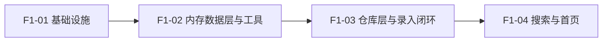

# 收纳助手（Shouna）架构规划 · F1

> 版本：**v3.0**（结构精简；F2/F3 相关内容一律置空或常量兜底） ｜ 上游：[docs/PRD.md](PRD.md) ｜ 路径基准：工程根 `shouna/`
> v1.x 架构文档与 `docs/arch/` 分册已废弃，如需查阅：`git show 046a39b:docs/arch/03-关键架构判断.md`。
> **F1 之后的实现见 [docs/ARCHITECTURE-P0.md](ARCHITECTURE-P0.md)**（P0 剩余 10 条）。本页自此**冻结为 F1 实现说明书**，不再更新；F1 之外的接缝与未决事项一律**以该页为准**。

**一句话结论**：F1 = 「记一件 → 搜到它 → 确认还在」的最小可运行闭环，**数据在内存、重启即丢**。物品一物一处（`storedItem.locationId` 单一归属）；位置与状态在 F1 只有内置常量、无 UI。

**本页范围（读前必看）**：本页只描述 **F1 要实现的**内容。**凡指向 F2/F3 的接缝、以及尚未决定的事项，一律「置空或常量兜底」——不在本页规划其实现、不预设方案、不做裁决，也不为其编写代码路径。** F1 的验收只以 F1 自身闭环为准。

## 0. 关键决策

| 决策点 | 结论 |
|---|---|
| 范围 | 7 条需求（FR-02 / FR-11 因无位置树塌陷）；无 F3 层内容 |
| 物品归属 | `storedItem.locationId` 单一归属、非空；同名物品按 `id` 区分 |
| 位置 | 无位置 UI；内存常量 1 条哨兵「未指定位置」，所有记录恒指它 |
| 状态 | 稳定字符串 code 三态：`in_storage` / `to_be_put_back` / `gone`；F1 只产生 `in_storage` |
| 存储 | F1 不落盘：`@Singleton` 内存源 + `MutableStateFlow`，重启即丢（持久化接缝置空） |
| 搜索 | 纯内存索引；检索维度 = 名称归一化子串 + 分类名，无拼音 |
| 主题 | 只有浅色且字号不跟随系统 |
| 边到边与系统栏 | 保留 `enableEdgeToEdge()`（API 35+ 本就强制）；**唯一容器级**避让 = 在 `RouteHandler` 的 `NavHost` 上施加 `systemBars ∪ displayCutout` 内边距，4 页不各自处理；**不含 IME** 系 F1 口径，**2026-09-29 已改为含 IME** —— 见 [ARCHITECTURE-P0.md](ARCHITECTURE-P0.md) §0 与 `docs/实现约束.md` §1（约束 1-5 / 1-6） |
| DI / 导航 | Hilt 2.57.1（KSP，仅服务 Hilt）；Navigation Compose 2.9.6 + 类型安全路由 4 条；单一 `RouteHandler` 全局路由，`NavController` 经 `LocalNavController` 共享 |
| 时间 | core library desugaring + `java.time`；模型内一律 `Long` epoch millis |
| 数据模型 | 3 个纯 Kotlin data class + 2 组内存常量；无 Entity / DAO / schema / 迁移 |
| F2/F3 接缝 | **全部置空或常量兜底**（§3.2、§7.1），F1 内不存在任何 F2 代码路径 |
| 未决事项 | **不裁决、不阻塞**，一律置空兜底（§7.3） |
| 任务 | 4 个（F1-01 ~ F1-04），强线性依赖 |

## 1. F1 范围

### 1.1 需求（7 条）

| 编号 | 需求 | F1 落地形态 |
|---|---|---|
| FR-09 | 极简录入 | 唯一必填项 = 物品名称；备注折叠可选；无位置字段 |
| FR-10 | 连续录入 | 「保存并继续」→ 清空输入、保持焦点、计数器 +1；零弹窗 |
| FR-12 | 可选快速分类 | 内置分类 chips 一排，点击即赋值，可跳过 |
| FR-19 | 全局搜索 | 单一搜索框，输入即出结果；名称归一化子串 + 分类名 |
| FR-26 | 「确认还在」 | 详情页 1 次点击刷新 `lastConfirmedAt`，UI 有可见反馈 |
| FR-02 | 位置路径面包屑 | **塌陷**（无位置树，不出现） |
| FR-11 | 最近使用位置 | **塌陷**（F1 不记录位置使用） |

> FR-09 / FR-10 原验收要点中的「位置可留空 / 位置已预填」两处子句随位置功能排除而失效。

### 1.2 页面（4 个）

| 页面 | F1 内容 | 路由 |
|---|---|---|
| 首页 | 搜索框（点击进搜索页并聚焦）+「＋ 记一件」 | `Home` |
| 快速录入 | 名称（自动聚焦，唯一必填）+ 分类 chips + 折叠备注 + 保存并继续 + 计数器 | `QuickAdd` |
| 搜索页 | 输入即搜；结果行 = 名称 + 关键词高亮（无路径、无分类后缀、无时间） | `Search(initialQuery: String? = null)` |
| 物品详情 | 名称 + 一行「最后确认：N 个月前 / 从未确认」+「✓ 还在」 | `ItemDetail(itemId: String)` |

> 详情页那一行时间**有意保留**：FR-26 若无可见反馈就是死按钮（不等同于实施双时间与超期提示，后者不在 F1）。

### 1.3 F1 明确不做

位置树与位置选择 / 改名、物品状态切换、待归位、双时间与超期提示、最近搜索词、筛选 chips、统计卡片、物品编辑页、分类管理、备份导出导入（**已于 2026-09-29 永久废弃，不进任何档位**）、设置页、任何 F2 页面与入口；以及拼音检索、本地落盘与数据库。

## 2. 分层与单向数据流

| 层 | 职责 | 禁止 |
|---|---|---|
| Screen（Composable） | 渲染 UiState、下发 `onXxx()`；`XxxScreen` 无状态、不取 ViewModel；同层 `XxxRoute` 是有状态包装层，唯一职责是 `hiltViewModel()` 取 ViewModel 后把 UiState 下传给 `XxxScreen` | 持有 Repository / 写业务逻辑 |
| 导航（`RouteHandler`） | 一个 `RouteHandler` 管全局路由：声明唯一 `NavHost(startDestination = Home)`，4 条 `composable<Route>` 与 4 个页一一注册，对外只暴露 `goHome()` / `goQuickAdd()` / `goSearch()` / `goItemDetail()` / `popBack()`；`NavController` 由 `MainActivity` 建一次、经 `LocalNavController` 共享；并对唯一 `NavHost` 施加 `systemBars ∪ displayCutout` 内边距（`WindowInsets.systemBars.union(WindowInsets.displayCutout)`），4 页统一避开状态栏与导航栏 | 写业务逻辑 / 取 ViewModel |
| ViewModel | 持有 `StateFlow<UiState>`、编排用例、异常映射为 UiState | 持有 Context（除 Application） |
| Repository（接口） | 用例编排、派生字段（归一化名 / 检索键）、失效过滤 | 暴露内存源内部结构 |
| `data/memory` | **唯一可变状态 owner**：`MutableStateFlow<List<StoredItem>>`，写入以 `Mutex` 串行化 | 含业务判断 / 被 UI 直接依赖 |
| domain | 纯 Kotlin 模型 + 纯函数 | 依赖 Android 框架 |

**ViewModel 与状态**：`HomeViewModel`（`isEmpty`）；`QuickAddViewModel`（`inputName` / `selectedCategoryId` / `note` / `sessionCount` / `canSave`）；`SearchViewModel`（`query` / `results` / `isIndexing`）；`ItemDetailViewModel`（`item` / `relativeConfirmText` / `isConfirming`）。

**Repository（2 个）**
- `ItemRepository`：`createItemQuick` / `observeItemSummaries` / `observeSearchDocs` / `getItemDetail` / `confirmItem`
- `CategoryRepository`：`observeCategories`
- 无 `LocationRepository`——位置只有 1 条常量哨兵，F1 无位置代码路径。

> F1 无 DAO 层，内存源即数据源。接口只暴露稳定领域类型、不泄漏内存源结构（兜底取向，使日后替换实现时 F1 侧无需改动）；**本页不规划该替换本身**。

## 3. 数据模型（内存态）

### 3.1 模型清单

| # | 模型 | F1 |
|---|---|---|
| 1 | `StoredItem` | **实写**（`MutableStateFlow<List<StoredItem>>`） |
| 2 | `Location` | 常量 1 条（兜底） |
| 3 | `Category` | 常量 8 条 |
| 4 | `Tag` / `ItemAlias` / `RecentLocation` / `RecentSearch` / `AppConfig` | **不建**（置空） |

### 3.2 `StoredItem`（纯 Kotlin data class）

| 字段 | 类型 | 说明 |
|---|---|---|
| `id` | `String` | UUID，`IdGenerator.newId()` 生成，源内唯一 |
| `name` | `String` | 名称，允许同名 |
| `normalizedName` | `String` | 归一化名称（全角→半角、大小写、空白折叠），检索用 |
| `aliasBlob` | `String` | **置空**：F1 恒为空串（无别名字段来源） |
| `locationId` | `String` | **兜底**：F1 恒 = `BuiltInData.UNSPECIFIED_LOCATION_ID` |
| `categoryId` | `String?` | 未填 = 未分类 |
| `status` | `ItemStatus` | **兜底**：F1 恒 = `IN_STORAGE` |
| `quantity` | `Int` | **置空**：无 UI，恒 1 |
| `note` | `String?` | F1 唯一可选字段（折叠） |
| `createdAt` / `lastModifiedAt` | `Long` | epoch millis UTC |
| `lastConfirmedAt` | `Long?` | 详情页展示、FR-26 写入 |

### 3.3 内置常量（`BuiltInData`）

| 常量 | 内容 |
|---|---|
| `UNSPECIFIED_LOCATION_ID` | 1 条 `Location`：名称「未指定位置」、`isBuiltIn = true`、无父级 |
| `BUILT_IN_CATEGORIES` | **8 条** `Category` 常量，F1 只读 |

### 3.4 不变量（无 DB 约束，由代码与单测守）

1. `StoredItem.locationId` 恒等于哨兵常量，且永不为空串。
2. `StoredItem.status` 在 F1 恒为 `IN_STORAGE`。
3. 哨兵只存在 1 条；`BUILT_IN_CATEGORIES` 恰好 8 条且 `id` 互不重复。

### 3.5 状态与时间

**`ItemStatus` 三态（稳定字符串 code，非 `enum.name`）**：`IN_STORAGE`=`in_storage`(active) / `TO_BE_PUT_BACK`=`to_be_put_back`(active) / `GONE`=`gone`(非 active)。F1 **只产生** `IN_STORAGE`，其余两态仅定义、不产生、无切换入口；「默认只查 active」的谓词在 F1 就落进仓库层过滤函数。

| 操作 | `lastModifiedAt` | `lastConfirmedAt` |
|---|---|---|
| 新建物品 | = now | 保持 NULL |
| 点「还在」 | 不动 | = now |
| 改名 / 改分类 / 改备注 | 不动 | 不动 |

> 一句话：F1 里只有「确认还在」会动时间戳，且只动 `lastConfirmedAt`。

## 4. F1 任务分解

> 4 个任务，强线性依赖；配置改动全部集中在 F1-01。

### F1-01 基础设施与依赖接入（无依赖）

- **涉及** `gradle/libs.versions.toml`✓、根 `build.gradle.kts`✓、`app/build.gradle.kts`✓、`AndroidManifest.xml`✓、`MainActivity.kt`✓、`ui/theme/Theme.kt`✓、`ui/theme/Color.kt`✓、`ShounaApplication.kt`、`ui/navigation/ShounaRoute.kt`（4 个 `@Serializable` 导航键，纯声明、不含 Composable）、`ui/navigation/RouteHandler.kt`（唯一 `NavHost` + `composable` 注册表 + `LocalNavController` 声明）、`di/AppModule.kt`
- **子步骤** ① 按 §6 写入依赖与插件、desugaring、`allowBackup="false"`；② 落地「永久浅色 + 固定字号」：`Theme.kt` 删 `darkTheme` 参数 / 深色分支 / `dynamicDarkColorScheme`（动态取色锁 `dynamicLightColorScheme`），并以 `CompositionLocalProvider(LocalDensity provides Density(density, fontScale = 1f))` 包住 `MaterialTheme`；`Color.kt` 删 `Purple80` / `PurpleGrey80` / `Pink80`；③ `ShounaApplication(@HiltAndroidApp)`；④ `MainActivity` 改 `@AndroidEntryPoint` + `CompositionLocalProvider(LocalNavController provides rememberNavController())` 包住 `ShounaTheme { RouteHandler() }`，删除 Hello；⑤ 定义 4 个 `@Serializable` 导航键（`Home` / `QuickAdd` / `Search(initialQuery)` / `ItemDetail(itemId)`）；`RouteHandler` 声明唯一 `NavHost(startDestination = Home)` 并把 4 条 Route 与 4 个占位页一一注册；`NavController` 只在 `MainActivity` 创建一次、经 `LocalNavController` 下发，`XxxScreen` 不得读取 `LocalNavController`；⑥ `AppModule` 提供 `IdGenerator` / `TimeUtil` / `SearchConfig` / IO `CoroutineScope`
- **验收** `:app:assembleDebug` 成功（空壳导航可运行）；Manifest **无任何** `uses-permission`；依赖树中无 `androidx.room`；API 24 调 `Instant.now()` 不崩；系统切深色后 UI 保持浅色；系统字号 200% 下 app 内文字尺寸不变
- **PRD 承接** NFR-01/02/03/17

### F1-02 内存数据层与横向工具（依赖 F1-01）

- **涉及** `domain/model/`：`StoredItem.kt` / `Location.kt` / `Category.kt` / `ItemDetail.kt` / `ItemStatus.kt`；`data/memory/InMemoryStore.kt` / `BuiltInData.kt`；`util/TextNormalizer.kt` / `TimeUtil.kt` / `IdGenerator.kt`；单测 2
- **子步骤** ① 5 个领域模型（`ItemStatus` 含稳定 code 与 `isActive`）；② `BuiltInData`：哨兵 1 条 + 内置分类 8 条；③ `InMemoryStore`（`@Singleton`，`MutableStateFlow` + `Mutex` 串行化，不暴露可变引用）；④ 归一化 / 时间 / UUID 三工具，归一化规则与检索键同源；⑤ 单测：归一化用例、哨兵唯一性、内置分类 8 条且 id 不重复
- **验收** `assembleDebug` 成功；单测全绿（**纯 JVM，无 Robolectric / 无仪器测试**）；全局搜索 `androidx.room` 零命中

### F1-03 仓库层与录入／详情闭环（依赖 F1-02）

- **涉及** `data/repository/ItemRepository.kt` + `ItemRepositoryImpl.kt`、`CategoryRepository.kt` + `Impl`、`di/RepositoryModule.kt`、`ui/screen/add/QuickAddScreen.kt` + `QuickAddViewModel.kt`、`ui/screen/itemdetail/ItemDetailScreen.kt` + `ItemDetailViewModel.kt`、`ui/component/CategoryChips.kt` / `RelativeTimeText.kt` / `ItemRow.kt`；单测 1
- **子步骤** ① `ItemRepository`：在 `Mutex` 临界区内生成归一化名与检索键并**原子追加**（无事务）；② `QuickAdd`：自动聚焦、分类 chips、折叠备注、保存并继续 + 计数器、零弹窗；③ `ItemDetail`：名称、一行相对时间、`✓ 还在` 写 `lastConfirmedAt`；④ 三个复用组件；⑤ 单测：`locationId` 恒哨兵、`status` 恒 `in_storage`、时间戳矩阵、连续录入 30 次不丢条目
- **验收** 单测全绿；连续录入 5 件 ≤40 秒（手测）；「确认还在」后详情页时间立即刷新
- **PRD 承接** FR-09/10/12/26、NFR-08

### F1-04 搜索与首页（依赖 F1-03）

- **涉及** `domain/search/`：`SearchDoc.kt` / `SearchIndex.kt` / `SearchScorer.kt` / `SearchHit.kt` / `MatchType.kt` / `SearchConfig.kt`；`ui/screen/search/SearchScreen.kt` + `SearchViewModel.kt`；`ui/screen/home/HomeScreen.kt` + `HomeViewModel.kt`；`ui/component/ShounaSearchBar.kt` / `EmptyState.kt`；单测 1
- **子步骤** ① `List<StoredItem>` → 内存 `SearchIndex`（权重排序、失效过滤、高亮区间）；② 输入即搜：`debounce(200ms)` + `collectLatest` + `Dispatchers.Default`；③ 索引重建触发 = 文档列表指纹（size + 最大 `lastModifiedAt`）变化；④ `SearchConfig` 只留 limit 与权重常量；⑤ `HomeScreen` 两元素
- **验收** 「风扇」命中「电风扇」（名称子串）；1000 件 ≤300ms、5000 件 ≤800ms（JVM 微基准）；冷启动不阻塞（索引懒构建）
- **PRD 承接** FR-19、NFR-05/06/07

## 5. 文件规模

新建约 **42** 个（F1-01 四 / F1-02 十二 / F1-03 十三 / F1-04 十三）；修改既有 **7** 个（`libs.versions.toml`、根与 app 构建文件、`AndroidManifest.xml`、`MainActivity.kt`、`ui/theme/Theme.kt`、`ui/theme/Color.kt`）；另**删除**模板自带的 `res/values-night/`（`colors.xml`、`themes.xml`）两个资源文件（§7.2）。源码根 `app/src/main/java/com/dream/shouna/`，单测根 `app/src/test/java/com/dream/shouna/`，**无仪器测试目录**。

## 6. 依赖版本与兼容性

| 依赖 | 版本 | 结论 |
|---|---|---|
| KSP 插件 `com.google.devtools.ksp` | 2.2.21-2.0.4 | 与 Kotlin 2.2.21 严格对应 ✓（仅服务 Hilt） |
| Hilt `hilt-android` / `-android-compiler(ksp)` | 2.57.1 | 支持 KSP2 + Kotlin 2.2.x，要求 JDK 17 ✓ |
| `androidx.hilt:hilt-navigation-compose` | 1.3.0 | pin 1.3.0，规避 1.4.0 的 `compileSdk 37` 要求 |
| `navigation-compose` | 2.9.6 | 要求 `compileSdk ≥ 35` / AGP ≥ 8.6.0，本工程 36 / 8.13.2 ✓ |
| Serialization 插件 + `kotlinx-serialization-json` | 1.9.0 | 要求 Kotlin ≥ 2.2.0 ✓ |
| `lifecycle-viewmodel-compose` / `-runtime-compose` | 2.10.0 | 对齐既有版本线 ✓ |
| `desugar_jdk_libs` | 2.1.5 | 要求 AGP ≥ 7.4.0 ✓ |
| 测试 `kotlinx-coroutines-test` / `truth` | 1.9.0 / 1.4.4 | 与既有 junit 4.13.2 共用 ✓ |

**工具链基线**（既有不改）：AGP 8.13.2、Kotlin 2.2.21、`compileSdk`/`targetSdk` 36、`minSdk` 24、JDK 17、Compose BOM 2025.12.01、`core-ktx` 1.18.0。

> `core-ktx` **钉 1.18.0 勿升**（1.19.0 声明 `minCompileSdk=37` + `minAGP 9.1.0`）。不新增仓库（`settings.gradle.kts` 保持 `google()` + `mavenCentral()`）。不引入 `INTERNET` 权限、Retrofit/OkHttp、埋点或云同步 SDK。

## 7. F1 之外（不执行，仅登记）

### 7.1 F2/F3 接缝：置空或常量兜底

F1 内所有指向 F2/F3 的位置**不预留实现、不写代码路径**，只做置空或常量兜底：

| 接缝 | F1 处置 |
|---|---|
| 持久化（本地落盘 / 数据库） | **置空**：只有内存源，无 DAO / 无 schema / 无迁移 |
| 位置层级与位置选择 | **兜底**：常量哨兵 1 条，无 `LocationRepository`、无位置 UI |
| 物品状态切换 / 待归位 | **兜底**：只产生 `IN_STORAGE`，其余两态仅定义 |
| 别名、拼音检索 | **置空**：`aliasBlob` 恒空串，无拼音字段、无拼音库 |
| 数量 | **置空**：`quantity` 恒 1，无 UI |
| `Tag` / `ItemAlias` / `RecentLocation` / `RecentSearch` / `AppConfig` | **不建** |

> 「F2 怎么接」不在本页范围：接口形态仅保证不泄漏内存源结构，替换实现本身不由 F1 负责。

> **接缝去向（2026-09-29 登记）**：[`ARCHITECTURE-P0.md`](ARCHITECTURE-P0.md) 已兑现上表 **4 项**——持久化（Room 5 表）、位置层级与位置选择（`LocationRepository` + 位置树）、物品状态切换（F1 档两动作 + `gone` 恢复）、拼音检索（FR-20）。**仍置空 3 项**：别名、数量、`Tag` / `ItemAlias` / `RecentLocation`；`RecentSearch` 与 `AppConfig` 已由该页建表（原「不建」条目部分失效）。F1 侧 §2 的 `ItemRepository` / `CategoryRepository` 接口形态按该页保持不改，**只换 Impl**。

### 7.2 永久不做

暗色模式（FR-48）、深色跟随（NFR-16）、字号跟随（NFR-13）——产品级撤销，F1 / F2 均不做；其移除由 F1-01 的浅色锁 + `fontScale = 1f` 落地，并在资源层与窗口层一并收敛：删除模板自带的 `res/values-night/`（`colors.xml` 的 `window_background=#1C1B1F` 与 `themes.xml` 的暗色父主题，均与浅色锁矛盾），另由 `MainActivity.attachBaseContext` 把 `uiMode` 锁 `NIGHT_NO`——使系统处于深色时 `enableEdgeToEdge()` 仍按浅色背景取**深色**系统栏图标（否则会给白图标，压在本 App 浅色背景上不可见）。

> 边到边与系统栏避让是本节的配套项：窗口边到边后，唯一容器 `RouteHandler` 的 `NavHost` 统一施加 `systemBars ∪ displayCutout` 内边距（§0 / §2）。

### 7.3 未决事项：不裁决、不阻塞

以下事项在本页**不做决定**，F1 实现按上述兜底口径进行即可：

> **结案登记（2026-09-29）**：下列 6 项中，属 P0 范围的 4 项已由 [`ARCHITECTURE-P0.md`](ARCHITECTURE-P0.md) 裁决——入口阈值门控（该页 §8.1-8：不做）、位置删除二选一（该页 §8.1-4：子树为单位 + 二选一对话框）、哨兵父级归属（该页 §3.3：根级节点）、`app_config` 键与默认值（该页 §3.1：`threshold_months = 6`）；第 4 项「F1 内存态验收口径」随该页 FR-41 落地而自动终止。**仅「字号锁定与无障碍规范的冲突」一项仍以本页为准。**

- 首启默认位置预置与「位置总数 ≥ 3 显示入口」阈值的口径冲突；
- 位置删除二选一（F1 档）无触发入口；
- 哨兵「未指定位置」的父级归属未定；
- F1 内存态的验收口径（重启即空）是否被接受；
- `app_config` 的键与默认值；
- 字号锁定与无障碍规范的冲突（已按锁定执行，留痕）。

---

*本文档为 F1 架构规划与任务分解，不含代码文件。F2/F3 相关内容与未决事项按「置空 / 兜底 / 不执行」处理，不构成对后续版本的承诺。*
