# 架构 · 02 实现方案总述
> 所属：收纳助手系统设计 v1.2 ｜ 父文档：[ARCHITECTURE.md](../ARCHITECTURE.md)
> 本文件回答：整体分几层、数据怎么流、每个技术点选了什么以及否决了什么。
> 依赖：— ｜ 被依赖：03 关键架构判断、07 依赖包清单

## 1. 实现方案总述

### 1.1 架构分层（单向数据流）

```mermaid
graph TD
    subgraph UI["UI 层（Jetpack Compose，无状态 + 事件回调）"]
        SCR["Screen (Composable)<br/>Home / Search / LocTree / LocDetail /<br/>Add / ItemDetail / ItemEdit / Stats / Settings / Backup / Onboard"]
        CMP["Reusable Component<br/>SearchBar / ItemRow / Breadcrumb / StatCard / Chips / ConfirmDialog"]
    end

    subgraph VM["状态持有层（ViewModel）"]
        VMF["StateFlow&lt;UiState&gt;（不可变 data class）<br/>接收 onXxx() Intents，调 Repository，映射为 UiState"]
    end

    subgraph DOM["领域层（domain）"]
        MODEL["domain/model：Item / Location / Category / Tag / ItemStatus / LocationPath"]
        SEARCH["domain/search：SearchDoc / SearchIndex / SearchScorer（纯 Kotlin，可单测）"]
        UC["domain/usecase（轻量，仅跨仓库编排：ConfirmLocationSubtree / DeleteLocation / ExportImport）"]
    end

    subgraph REPO["仓库层（data/repository）"]
        R1["ItemRepository"]
        R2["LocationRepository"]
        R3["CategoryRepository"]
        R4["BackupRepository"]
    end

    subgraph DATA["数据层（data/local）"]
        DAO["DAO（Room @Query / @Transaction）"]
        ENT["Entity（9 张表）"]
        DB["ShounaDatabase + SeedCallback"]
        CONV["Converters（Instant↔Long, ItemStatus↔String）"]
    end

    subgraph UTIL["工具层（util）"]
        PY["PinyinUtil（houbb pinyin 封装）"]
        NRM["TextNormalizer（全角/大小写/空白归一化）"]
        TM["TimeUtil（java.time，UTC 毫秒）"]
        ID["IdGenerator（UUID）"]
    end

    SCR -->|onXxx 事件| VMF
    VMF -->|观察 Flow| REPO
    CMP -.被复用.-> SCR
    REPO --> MODEL
    REPO --> SEARCH
    REPO -.使用.-> UC
    REPO --> DAO
    DAO --> ENT
    DAO --> DB
    DB --> CONV
    REPO --> UTIL
    SEARCH --> PY
    SEARCH --> NRM
```

**数据流约束（硬规则）**：
1. UI 只读 `UiState`，只发 `onXxx()` 事件；**UI 不直接访问 Repository / DAO / Context**。
2. Repository 返回 `Flow`（观察）或 `suspend`（一次性命令）；**所有写操作必须经 Repository**，DAO 不对外暴露。
3. 归一化 / 拼音 / ID / 时间等横向能力统一放 `util`，禁止在各层重复实现。
4. 所有破坏性写操作的**事务边界在 Repository**，ViewModel 不管理事务。

### 1.2 技术选型总表

| 技术点 | 选型 | 版本 | 理由 | 被否决方案 |
|---|---|---|---|---|
| 本地存储 | Room（SQLite） | 2.8.4 | 关系建模（递归位置树 + 物品归属外键）、编译期 SQL 校验、`Flow` 响应式、迁移可控；minSdk 23 ≤ 24，无 compileSdk 37 要求 | ① 纯文件 JSON（无并发/查询/事务）；② DataStore/键值（无法支撑递归位置树与引用完整性） |
| 注解处理 | **KSP（非 kapt）** | 2.2.21-2.0.4 | 与 Kotlin 2.2.21 严格匹配的官方版本；比 kapt 快 40–60%；Room/Hilt 均原生支持 KSP | kapt（已不推荐、构建慢、需额外配置） |
| 物品归属 | `item.locationId` 单一归属（一物一处） | — | 一件物品只归属一个位置，与「同一东西只可能在一个地方」的物理事实一致；同名物品是**彼此独立的实体**，以 ID 判定（约束 A-6）；见 [03-关键架构判断.md §2.2](03-关键架构判断.md) 与 [04-数据结构与接口.md](04-数据结构与接口.md) | 独立 `placement` 多对多表（为「一物多处」引入关联表 + 部分唯一索引 + 主位置维护，收益不抵复杂度；**v1.2 已作废**，见 [03-关键架构判断.md §2.2](03-关键架构判断.md)） |
| 搜索 | 内存归一化索引（Room 全量投影） | — | 家庭数据量几百~几千；需中文**子串**+拼音前缀混排；FTS 对 CJK 子串能力弱且 API 24 上 FTS5 trigram 不可用 | Room FTS4/FTS5（见 [03-关键架构判断.md §2.3](03-关键架构判断.md) 详细否决理由） |
| 拼音 | houbb pinyin（Maven Central） | 0.4.0 | 离线、纯 Java（编译目标 1.7，minSdk 24 兼容）、Apache-2.0、**Maven Central 直取（无需 JitPack）**、支持全拼(`NORMAL`) + 首字母(`FIRST_LETTER`) | ① TinyPinyin `com.github.promeg:tinypinyin`（**仅 JitPack 的 `v2.0.3` 可解析**，且会拖入 `tinypinyin-android-asset-lexicons` AAR，多仓库+体积↑，见 [07-依赖包清单.md §6.7](07-依赖包清单.md)）；② `io.github.biezhi:TinyPinyin:2.0.3`（Maven Central 再发布，但 **`packaging=pom`**、`<name>` 错写成 `redis-dqueue`、额外运行时依赖 `ahocorasick`，可信度不足）；③ jpinyin 1.1.8（**GPL v3.0 许可**，与商业 App 链接有法律风险）；④ pinyin4j（约 +250KB、能力过剩）；⑤ 自建映射表（准确率与维护风险） |
| DI | Hilt（KSP） | 2.57.1 | 与 Room 共用 KSP；编译期校验；`@HiltViewModel` + `hiltViewModel()` 与 Compose 原生集成；**运行时 ~0 开销**（代码预生成），符合冷启动 NFR-03 | Koin（运行期解析图、无编译校验、多一个运行时库）；手写 `AppContainer`（样板多、测试替换弱，作为最后回退） |
| 导航 | Navigation Compose（类型安全路由） | 2.9.6 | 2.9.0 起要求 compileSdk ≥35 / AGP ≥8.6，与 compileSdk 36 + AGP 8.13.2 兼容；类型安全路由消除字符串拼参错误 | 字符串路由（易错）；Navigation 3（预发布，不稳） |
| JSON 序列化 | kotlinx-serialization-json | 1.9.0 | 与 Kotlin 2.2.21 同源（要求 Kotlin ≥2.2.0）；编译期生成序列化器、无反射、体积小；**同一插件同时服务导航类型安全路由** | org.json（手写、无类型安全）；Moshi（反射/kapt、多一个依赖） |
| 时间 | `java.time` + core library desugaring | desugar 2.1.5 | API 24 无 `java.time`，desugaring 后可用；日期加减（+6 个月阈值、"N 个月前"）语义清晰、错误少 | 退回 `Calendar`（易错、可读性差、时区处理繁琐） |
| 时间落库 | `Long`（epoch millis, UTC） | — | 排序/比较/阈值判定最快；无时区歧义；导出可读 | 存字符串（排序慢、解析成本） |
| ID | String UUID | — | 导出/导入**合并无冲突**，免去重映射；内置项用固定哨兵 UUID 便于识别；**同名物品靠 ID 区分身份**（约束 A-6） | 自增 Long（导入合并必冲突，需重映射） |
| 状态落库 | 稳定字符串 code | — | 新增状态不改变既有值，向后/向前兼容；导出 JSON 可读 | Int（新增状态会错位） |
| 偏好/设置 | Room KV 表 `app_config` + 两张 recents 表 | — | 复用同一存储，**不新增 androidx 依赖**（避免再核对 AAR `minCompileSdk`） | DataStore Preferences（多一个需核对兼容性的依赖，收益有限） |
