# 架构 · 04 数据结构与接口
> 所属：收纳助手系统设计 v1.1 ｜ 父文档：[ARCHITECTURE.md](../ARCHITECTURE.md)
> 本文件回答：有哪些实体 / DAO / 仓库 / 领域模型，字段与方法签名是什么。
> 依赖：03 关键架构判断 ｜ 被依赖：05 调用流程时序图、06 文件列表、11 任务列表

## 3. 数据结构与接口（类图）

> 图中字段与方法签名可直接照抄实现。`Instant` 在 domain 层使用；Entity 层一律 `Long`。

```mermaid
classDiagram
    %% ============ 枚举 ============
    class ItemStatus {
        <<enum>>
        IN_STORAGE
        TO_BE_PUT_BACK
        DISCARDED
        GIVEN_AWAY
        USED_UP
        +code: String
        +isActive: Boolean
    }
    class LocationType {
        <<enum>>
        ROOM
        CABINET
        BOX
        SLOT
        OTHER
    }
    class ImportStrategy {
        <<enum>>
        OVERWRITE
        MERGE
    }
    class DeleteMode {
        <<enum>>
        CASCADE_DELETE_ITEMS
        MIGRATE_ITEMS
    }

    %% ============ Entity ============
    class ItemEntity {
        +id: String
        +name: String
        +normalizedName: String
        +pinyinFull: String
        +pinyinInitials: String
        +aliasBlob: String
        +categoryId: String?
        +status: String
        +quantity: Int
        +note: String?
        +createdAt: Long
        +lastModifiedAt: Long
        +lastConfirmedAt: Long?
    }
    class LocationEntity {
        +id: String
        +parentId: String?
        +name: String
        +typeTag: String?
        +isTemporary: Boolean
        +isBuiltIn: Boolean
        +note: String?
        +sortOrder: Int
        +path: String
        +depth: Int
        +createdAt: Long
    }
    class PlacementEntity {
        +itemId: String
        +locationId: String
        +isPrimary: Boolean
        +quantity: Int?
        +note: String?
        +lastConfirmedAt: Long?
        +createdAt: Long
    }
    class CategoryEntity {
        +id: String
        +name: String
        +iconKey: String?
        +colorHex: String?
        +isBuiltIn: Boolean
        +sortOrder: Int
    }
    class TagEntity {
        +id: String
        +name: String
        +normalizedName: String
    }
    class ItemTagCrossRef {
        +itemId: String
        +tagId: String
        +createdAt: Long
    }
    class ItemAliasEntity {
        +id: String
        +itemId: String
        +text: String
        +normalizedText: String
        +pinyinFull: String
        +pinyinInitials: String
    }
    class AppConfigEntity {
        +key: String
        +value: String
    }
    class RecentLocationEntity {
        +locationId: String
        +lastUsedAt: Long
    }
    class RecentSearchEntity {
        +id: String
        +query: String
        +queryNormalized: String
        +lastSearchedAt: Long
    }

    %% ============ Domain Model ============
    class Item {
        +id: String
        +name: String
        +categoryId: String?
        +status: ItemStatus
        +quantity: Int
        +note: String?
        +createdAt: Instant
        +lastModifiedAt: Instant
        +lastConfirmedAt: Instant?
    }
    class Location {
        +id: String
        +parentId: String?
        +name: String
        +type: LocationType?
        +isTemporary: Boolean
        +isBuiltIn: Boolean
        +note: String?
        +sortOrder: Int
        +path: String
        +depth: Int
    }
    class Placement {
        +itemId: String
        +locationId: String
        +isPrimary: Boolean
        +quantity: Int?
        +note: String?
        +lastConfirmedAt: Instant?
    }
    class ItemDetail {
        +item: Item
        +placements: List~Placement~
        +primaryLocationPath: List~String~
        +categoryName: String?
        +tags: List~String~
        +aliases: List~String~
    }
    class ItemListRow {
        +itemId: String
        +name: String
        +status: ItemStatus
        +quantity: Int
        +primaryLocationId: String?
        +primaryLocationPath: String?
        +categoryName: String?
        +isTemporaryLocation: Boolean
        +lastConfirmedAt: Instant?
        +lastModifiedAt: Instant
    }
    class LocationTreeRow {
        +id: String
        +parentId: String?
        +name: String
        +isTemporary: Boolean
        +isBuiltIn: Boolean
        +depth: Int
        +sortOrder: Int
        +directItemCount: Int
        +subtreeItemCount: Int
    }
    class SearchDoc {
        +itemId: String
        +name: String
        +normalizedName: String
        +pinyinFull: String
        +pinyinInitials: String
        +aliasBlob: String
        +categoryNameNormalized: String?
        +locationNamesNormalized: List~String~
        +tagNamesNormalized: List~String~
        +status: ItemStatus
        +lastConfirmedAt: Instant?
        +createdAt: Instant
    }
    class SearchHit {
        +doc: SearchDoc
        +score: Int
        +matchType: MatchType
        +highlightRanges: List~IntRange~
    }
    class SearchFilters {
        +categoryIds: Set~String~
        +locationIds: Set~String~
        +statuses: Set~ItemStatus~
        +onlyIncomplete: Boolean
    }
    class MatchType {
        <<enum>>
        NAME_PREFIX
        NAME_SUBSTRING
        ALIAS
        PINYIN_INITIALS
        PINYIN_FULL
        TAG
        LOCATION
        CATEGORY
    }

    %% ============ Search Engine ============
    class SearchIndex {
        -docs: List~SearchDoc~
        +query(raw: String, filters: SearchFilters, includeInactive: Boolean, limit: Int): List~SearchHit~
        -score(doc, qNorm, qInitials): SearchHit?
    }
    class SearchScorer {
        +weight(type: MatchType): Int
        +compare(a: SearchHit, b: SearchHit): Int
    }

    %% ============ DAO ============
    class ItemDao {
        +observeActiveSummaries(): Flow~List~ItemListRow~~
        +observeSearchDocs(): Flow~List~SearchDoc~~
        +getDetail(itemId: String): ItemDetail?
        +insert(item: ItemEntity)
        +update(item: ItemEntity)
        +updateStatus(itemId: String, status: String, modifiedAt: Long)
        +updateConfirm(itemId: String, confirmedAt: Long)
        +updateSearchKeys(itemId: String, normalized: String, pinyinFull: String, pinyinInitials: String, aliasBlob: String)
        +deleteById(itemId: String)
        +deleteByIds(ids: List~String~)
        +findSimilar(normalized: String): List~ItemEntity~
        +countActive(): Int
        +countIncomplete(): Int
    }
    class LocationDao {
        +observeTreeRows(): Flow~List~LocationTreeRow~~
        +getById(id: String): LocationEntity?
        +observeAll(): Flow~List~LocationEntity~~
        +insert(loc: LocationEntity)
        +update(loc: LocationEntity)
        +updateName(id: String, name: String)
        +descendantIds(prefix: String): List~String~
        +updateSubtreePath(oldPrefix: String, newPrefix: String, deltaDepth: Int)
        +deleteSubtree(prefix: String)
        +countAll(): Int
        +observeRecent(limit: Int): Flow~List~LocationTreeRow~~
        +touchRecent(id: String, at: Long)
        +confirmSubtree(prefix: String, at: Long): Int
    }
    class PlacementDao {
        +observeByItem(itemId: String): Flow~List~PlacementEntity~~
        +getByItem(itemId: String): List~PlacementEntity~
        +insert(p: PlacementEntity)
        +delete(itemId: String, locationId: String)
        +clearPrimary(itemId: String)
        +setPrimaryFlag(itemId: String, locationId: String)
        +getPrimary(itemId: String): PlacementEntity?
        +migrateSubtree(oldPrefix: String, targetId: String)
        +reassignPrimary(oldItemIds: List~String~, at: Long)
        +confirmBySubtree(prefix: String, at: Long): Int
        +countAll(): Int
    }
    class CategoryDao {
        +observeAll(): Flow~List~CategoryEntity~~
        +getById(id: String): CategoryEntity?
        +insert(c: CategoryEntity)
        +updateName(id: String, name: String)
        +delete(id: String)
        +countName(name: String): Int
    }
    class TagDao {
        +observeByItem(itemId: String): Flow~List~TagEntity~~
        +upsert(tag: TagEntity)
        +findByNormalized(normalized: String): TagEntity?
        +link(cross: ItemTagCrossRef)
        +unlink(itemId: String, tagId: String)
    }
    class ConfigDao {
        +get(key: String): String?
        +put(entry: AppConfigEntity)
        +observe(key: String): Flow~String?~
    }

    %% ============ Database ============
    class ShounaDatabase {
        <<abstract>>
        +itemDao(): ItemDao
        +locationDao(): LocationDao
        +placementDao(): PlacementDao
        +categoryDao(): CategoryDao
        +tagDao(): TagDao
        +configDao(): ConfigDao
    }
    class SeedCallback {
        +onCreate(db: SupportSQLiteDatabase)
        +BULLETIN...
    }

    %% ============ Repository ============
    class ItemRepository {
        <<interface>>
        +observeItemSummaries(): Flow~List~ItemListRow~~
        +observeSearchDocs(): Flow~List~SearchDoc~~
        +getItem(id: String): ItemDetail?
        +createItemQuick(name, locationId, categoryId, quantity): String
        +updateItem(item: Item, aliases: List~String~, tags: List~String~)
        +setStatus(itemId: String, status: ItemStatus)
        +confirmItem(itemId: String, at: Instant)
        +moveItem(itemId: String, toLocationId: String, asPrimary: Boolean)
        +addPlacement(itemId, locationId, quantity, note, makePrimary)
        +removePlacement(itemId: String, locationId: String)
        +deleteItem(itemId: String)
        +purgeInactive(ids: List~String~)
        +findSimilar(name: String): List~ItemListRow~
    }
    class LocationRepository {
        <<interface>>
        +observeTree(): Flow~List~LocationTreeRow~~
        +observeRecent(limit: Int): Flow~List~LocationTreeRow~~
        +getLocation(id: String): LocationEntity?
        +breadcrumb(id: String): List~String~
        +createLocation(parentId, name, type, isTemporary): String
        +rename(id: String, newName: String)
        +update(loc: Location)
        +move(id: String, newParentId: String?)
        +merge(sourceId: String, targetId: String)
        +deleteLocation(id: String, mode: DeleteMode, migrateTargetId: String?)
        +confirmSubtree(id: String, at: Instant): Int
        +touchRecent(id: String, at: Instant)
        +applyTemplate(template: String)
    }
    class CategoryRepository {
        <<interface>>
        +observeCategories(): Flow~List~CategoryEntity~~
        +create(name, iconKey, colorHex): String
        +rename(id: String, newName: String)
        +delete(id: String): DeleteResult
    }
    class BackupRepository {
        <<interface>>
        +export(uri: Uri): ExportResult
        +inspect(uri: Uri): BackupManifest
        +import(uri: Uri, strategy: ImportStrategy): ImportResult
    }
    class DeleteResult {
        <<enum>>
        OK
        REJECTED_BUILT_IN
        REJECTED_NOT_EMPTY
        NOT_FOUND
    }
    class ExportResult
    class ImportResult
    class BackupManifest

    %% ============ Util ============
    class PinyinUtil {
        +toFullPinyin(text: String): String
        +toInitials(text: String): String
    }
    class TextNormalizer {
        +normalize(text: String): String
        +contains(haystack: String, needle: String): Boolean
    }
    class TimeUtil {
        +now(): Instant
        +toEpochMilli(i: Instant): Long
        +toInstant(millis: Long?): Instant?
        +monthsAgo(now: Instant, months: Int): Instant
        +formatRelative(i: Instant, now: Instant): String
    }
    class IdGenerator {
        +newId(): String
        +const UNSPECIFIED_LOCATION_ID: String
        +const TO_BE_PUT_BACK_LOCATION_ID: String
    }

    %% ============ Relationships ============
    ItemEntity "1" --> "0..1" CategoryEntity : categoryId (SET NULL)
    ItemEntity "1" --> "*" PlacementEntity : placements (CASCADE)
    LocationEntity "1" --> "*" PlacementEntity : placements (CASCADE)
    LocationEntity "0..1" --> "*" LocationEntity : parentId (RESTRICT)
    ItemEntity "1" --> "*" ItemAliasEntity : aliases (CASCADE)
    ItemEntity "1" --> "*" ItemTagCrossRef : itemTag
    TagEntity "1" --> "*" ItemTagCrossRef : itemTag
    LocationEntity "1" --> "0..1" RecentLocationEntity : recent (CASCADE)

    ItemEntity ..> Item : mapsTo
    LocationEntity ..> Location : mapsTo
    PlacementEntity ..> Placement : mapsTo
    Item ..> ItemStatus : uses
    ItemDetail *-- Item
    ItemDetail *-- Placement
    SearchDoc ..> ItemStatus : uses
    SearchIndex o-- SearchDoc
    SearchIndex ..> SearchScorer : uses
    SearchHit *-- SearchDoc
    SearchHit ..> MatchType : uses
    SearchIndex ..> SearchFilters : accepts

    ItemDao ..> ItemEntity
    ItemDao ..> ItemListRow
    ItemDao ..> SearchDoc
    LocationDao ..> LocationEntity
    LocationDao ..> LocationTreeRow
    PlacementDao ..> PlacementEntity
    CategoryDao ..> CategoryEntity
    TagDao ..> TagEntity
    ConfigDao ..> AppConfigEntity
    ShounaDatabase *-- ItemDao
    ShounaDatabase *-- LocationDao
    ShounaDatabase *-- PlacementDao
    ShounaDatabase *-- CategoryDao
    ShounaDatabase *-- TagDao
    ShounaDatabase *-- ConfigDao
    ShounaDatabase ..> SeedCallback : invokes onCreate

    ItemRepository ..> ItemDao
    ItemRepository ..> PlacementDao
    ItemRepository ..> TagDao
    ItemRepository ..> PinyinUtil
    ItemRepository ..> TextNormalizer
    ItemRepository ..> IdGenerator
    LocationRepository ..> LocationDao
    LocationRepository ..> PlacementDao
    CategoryRepository ..> CategoryDao
    BackupRepository ..> ShounaDatabase
    BackupRepository ..> ItemDao
    BackupRepository ..> LocationDao
    ItemRepository ..> SearchDoc : produces
```

