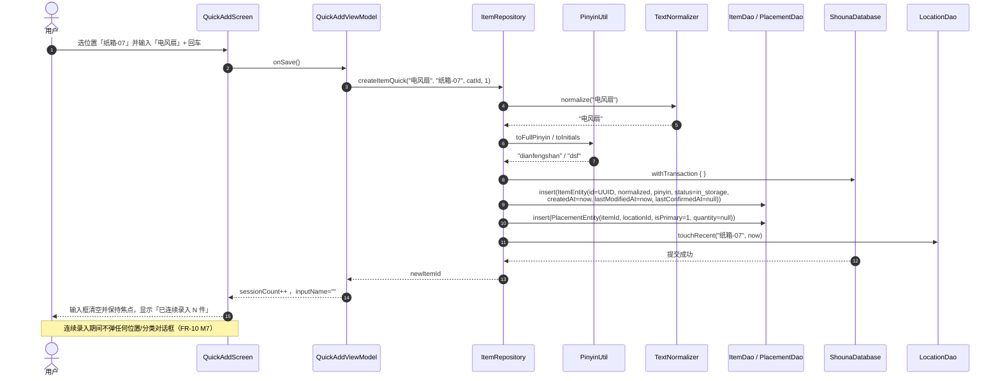
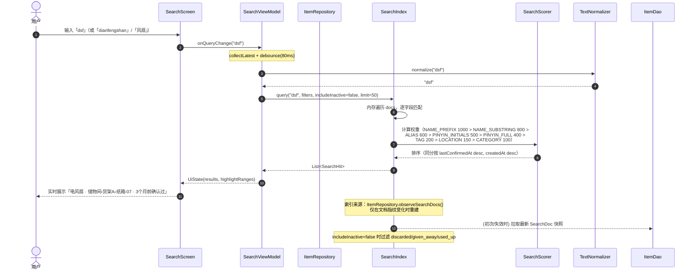
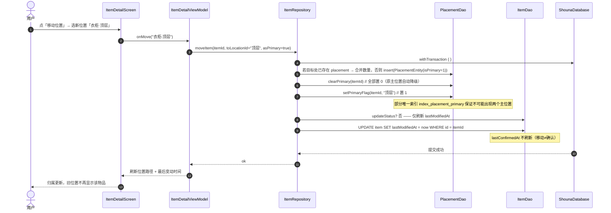
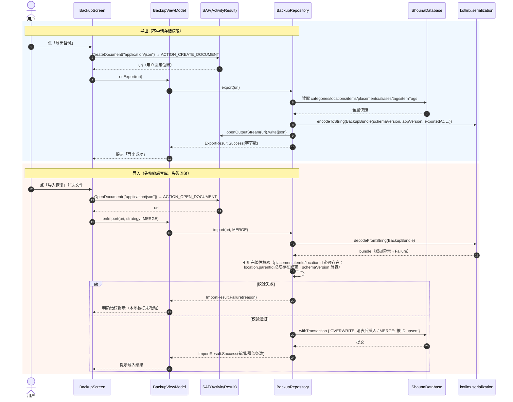
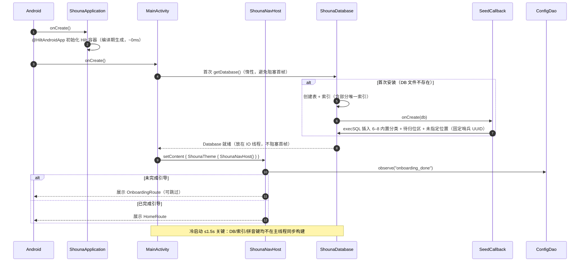

# 架构 · 05 调用流程时序图
> 所属：收纳助手系统设计 v1.1 ｜ 父文档：[ARCHITECTURE.md](../ARCHITECTURE.md)
> 本文件回答：录入 / 搜索 / 移动 / 备份 / 启动这五条关键链路具体怎么走。
> 依赖：04 数据结构与接口 ｜ 被依赖：11 任务列表

## 4. 调用流程（时序图）

### 4.1 连续录入 N 件物品（含检索键生成 + 事务写入）

### 4.2 全局搜索（含归一化、权重排序、过滤失效物品）

### 4.3 移动物品位置（含主位置切换 + 双时间刷新）

### 4.4 导出与导入备份

### 4.5 启动加载与首次种子数据初始化

