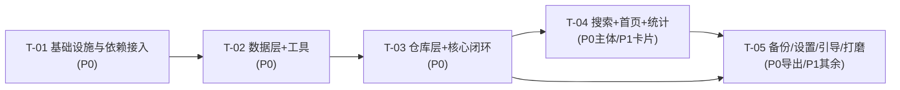

# 架构 · 11 任务列表
> 所属：收纳助手系统设计 v1.1 ｜ 父文档：[ARCHITECTURE.md](../ARCHITECTURE.md)
> 本文件回答：按什么顺序、依赖谁、由哪个任务产出哪些文件。
> 依赖：02 实现方案总述、03 关键架构判断、04 数据结构与接口、06 文件列表、07 依赖包清单 ｜ 被依赖：—

> **路径基准**：工程根 = `shouna/`
> 源码根 = `app/src/main/java/com/dream/shouna/`（未加前缀的源码路径均以此为准）
> 单测根 = `app/src/test/java/com/dream/shouna/`
> 仪器测试根 = `app/src/androidTest/java/com/dream/shouna/`
> 资源根 = `app/src/main/res/`

## 10. 任务列表（有序 · 带依赖 · 按实现顺序）

> 遵循「**≤5 个实现任务**」的硬约束：T-01…T-05 为**依赖序实现任务**，每个任务内含**可照抄的文件级子步骤**。任务分组按**功能模块/层次**，不按单文件拆分；每个任务均 ≥3 个文件；配置文件全部集中在 T-01，不分散。
> **P0 闭环 = T-01 + T-02 + T-03 + T-04**；**P1 增强 = T-05**。

### T-01 项目基础设施与依赖接入（P0 · 无依赖）

| 项 | 内容 |
|---|---|
| **任务名** | 项目基础设施与依赖接入 |
| **涉及文件** | 根 `build.gradle.kts`✓、`settings.gradle.kts`✓、`gradle/libs.versions.toml`✓、`app/build.gradle.kts`✓、`app/src/main/AndroidManifest.xml`✓、`ShounaApplication.kt`、`MainActivity.kt`✓、`ui/navigation/Routes.kt`、`ui/navigation/ShounaNavHost.kt`、`di/AppModule.kt`、`di/DatabaseModule.kt` |
| **依赖任务** | — |
| **子步骤** | ① 按 [07-依赖包清单.md §6.2/§6.3/§6.5/§6.6](07-依赖包清单.md) 草稿写入依赖与插件、desugaring、`room.schemaLocation`、`allowBackup=false`、注册 `ShounaApplication`（**[07-依赖包清单.md §6.4](07-依赖包清单.md) 无需改动：不新增外部仓库**）；② 落地 `ShounaApplication(@HiltAndroidApp)`；③ `MainActivity` 改 `@AndroidEntryPoint` + `ShounaNavHost()`，删除 Hello；④ 定义 11 个 `@Serializable` 路由与 `NavHost`（先接占位页）；⑤ `AppModule` 提供工具/Scope，`DatabaseModule` 提供 DB 与各 Dao |
| **验收点** | 工程可 `./gradlew :app:assembleDebug` 成功（空壳导航可运行）；`Manifest` **无任何 `uses-permission`**；KSP/Hilt/Serialization 插件生效（生成代码可见）；desugaring 开启后 API 24 设备调 `Instant.now()` 不崩 |
| **PRD 承接** | NFR-01/02/03/17；[PRD 07 页面结构与关键交互](../prd/07-页面结构与关键交互.md) §6.2 导航结构 |

### T-02 数据层：实体 / DAO / 数据库 / 种子 / 工具（P0 · 依赖 T-01）

| 项 | 内容 |
|---|---|
| **任务名** | 数据层与横向工具 |
| **涉及文件** | `data/local/entity/*`（10 个）、`data/local/dao/*`（6 个）、`data/local/relation/*`（3 个）、`data/local/converter/Converters.kt`、`data/local/ShounaDatabase.kt`、`data/local/SeedCallback.kt`、`util/PinyinUtil.kt`、`util/TextNormalizer.kt`、`util/TimeUtil.kt`、`util/IdGenerator.kt`、`domain/model/ItemStatus.kt`、`domain/model/LocationType.kt`、`app/src/test/java/com/dream/shouna/util/PinyinUtilTest.kt`、`app/src/test/java/com/dream/shouna/util/TextNormalizerTest.kt`、`app/src/androidTest/java/com/dream/shouna/db/SeedDataTest.kt` |
| **依赖任务** | T-01 |
| **子步骤** | ① 按 [03-关键架构判断.md §2.2](03-关键架构判断.md) / [04-数据结构与接口.md](04-数据结构与接口.md) 定义 10 个 Entity（含 FK 级联、索引、复合主键）；② 6 个 DAO（含 `@Transaction` 组合查询）；③ 3 个 relation 投影；④ `Converters`（`ItemStatus↔code`、`Instant↔Long`）；⑤ `ShounaDatabase(version=1, exportSchema=true)` + `SeedCallback`（种子 + 部分唯一索引原始 SQL）；⑥ 四个 util 工具；⑦ 拼音/归一化单测 + 种子/索引存在性仪器测试 |
| **验收点** | `./gradlew :app:assembleDebug` 生成 schema 到 `app/schemas`；仪器测试：首启后内置分类=8、`待归位区`/`未指定位置` 存在、`index_placement_primary` 存在；`PinyinUtilTest` 断言「电风扇」→`dsf`/`dianfengshan` |
| **PRD 承接** | FR-41、FR-20/Q8、Q9、[PRD 08 数据字段业务语义](../prd/08-数据字段业务语义.md) §7.1–7.5、[09-待明确事项.md](09-待明确事项.md) A-3 |

### T-03 仓库层 + 核心业务闭环：位置树 / 录入 / 详情（P0 · 依赖 T-02）

| 项 | 内容 |
|---|---|
| **任务名** | 仓库层与「建位置→极简录入→看位置与可信度」闭环 |
| **涉及文件** | `data/repository/ItemRepository.kt`+`Impl`、`LocationRepository.kt`+`Impl`、`CategoryRepository.kt`+`Impl`、`di/RepositoryModule.kt`、`domain/model/*`（Item/Location/Placement/Category/Tag/ItemDetail/ItemListRow/LocationTreeRow）、`domain/usecase/ConfirmLocationSubtree.kt`、`domain/usecase/DeleteLocation.kt`、`ui/screen/add/QuickAddScreen.kt`+`VM`、`ui/screen/locdetail/LocationDetailScreen.kt`+`VM`、`ui/screen/itemdetail/ItemDetailScreen.kt`+`VM`、`ui/component/CategoryChips.kt`、`ui/component/ConfirmDialog.kt`、`ui/component/RelativeTimeText.kt`、`app/src/test/java/com/dream/shouna/data/ItemRepositoryImplTest.kt`、`app/src/test/java/com/dream/shouna/data/LocationRepositoryImplTest.kt` |
| **子步骤** | ① Repository 接口与实现（事务边界、检索键生成、主位置维护、失效过滤、双时间规则）；② 位置树：建/改名/移动/合并/删除两路径/批量确认/模板；③ `QuickAdd`（连续录入、最近位置、重名提示、零弹窗）；④ `LocationDetail`（本层/含子层件数、批量确认、批量录入入口、子位置）；⑤ `ItemDetail`（路径面包屑、双时间、确认/移动/状态变更）；⑥ 复用组件；⑦ 主位置唯一 + 双时间矩阵 + 删位置无孤儿单测 |
| **验收点** | 单测全绿：主位置唯一、7×2 双时间矩阵、删位置两路径无孤儿、`path` 移动后正确；`QuickAddScreen` 连续录入 5 件 ≤40s（手测）；US-01/02/04/05/06/07 逐条通过；US-03 的「位置路径 + 最后确认时间」可见 |
| **PRD 承接** | FR-01/02/03/05/09/10/11/25/26/27、Q2/Q3/Q6/Q7/Q11/Q12、[PRD 06 必须正面处理的难点](../prd/06-必须正面处理的难点.md) §5.1/§5.2 / [PRD 08 数据字段业务语义](../prd/08-数据字段业务语义.md) §7.3 |

### T-04 搜索与索引 + 首页 / 位置树页 / 统计（P0 主体 + P1 卡片 · 依赖 T-03）

| 项 | 内容 |
|---|---|
| **任务名** | 搜索能力与归纳统计 |
| **涉及文件** | `domain/search/*`（SearchDoc/SearchIndex/SearchScorer/SearchHit/MatchType/SearchFilters/SearchConfig）、`ui/screen/search/SearchScreen.kt`+`VM`、`ui/screen/home/HomeScreen.kt`+`VM`、`ui/screen/loctree/LocationTreeScreen.kt`+`VM`、`ui/screen/stats/StatsScreen.kt`+`VM`、`ui/component/ShounaSearchBar.kt`、`ui/component/ItemRow.kt`、`ui/component/LocationBreadcrumb.kt`、`ui/component/LocationTreeItem.kt`、`ui/component/StatCard.kt`、`ui/component/EmptyState.kt`、`app/src/test/java/com/dream/shouna/search/SearchIndexTest.kt` |
| **子步骤** | ① `SearchDoc` 投影→内存 `SearchIndex`（权重排序、失效过滤、筛选叠加、高亮区间）；② 降级策略（`SearchConfig` 阈值）；③ `SearchScreen`（输入即搜 `debounce+collectLatest`、筛选 chips、长按快捷菜单）；④ `HomeScreen`（搜索入口/最近位置/需关注/统计摘要）；⑤ `LocationTreeScreen`（内存树、展开收起、本层/含子层件数、长按菜单）；⑥ `StatsScreen`（C-1 总览 P0；C-2/3/4/5/6/7 卡片 P1，可下钻）；⑦ `SearchIndexTest` 覆盖拼音/子串/权重/失效过滤 |
| **验收点** | 搜索：`dsf`/`dianfengshan`/`风扇` 均命中「电风扇」（US-03）；1000 件 ≤300ms、5000 件 ≤800ms（微基准）；已失效物品默认不出现（US-06）；统计 ≥4 卡片且可下钻（US-08）；位置树 500 节点展开滚动无掉帧（NFR-07） |
| **PRD 承接** | FR-19/20/21/22、FR-33（P0）、FR-34/35/36/37/38（P1）、NFR-05/06/07、[PRD 08 数据字段业务语义](../prd/08-数据字段业务语义.md) §7.6、[PRD 09 归纳汇总](../prd/09-归纳汇总.md) §8 |

### T-05 备份恢复 / 设置 / 引导 / 编辑 / 打磨（P0 导出 + P1 其余 · 依赖 T-03、T-04）

| 项 | 内容 |
|---|---|
| **任务名** | 数据安全与体验打磨 |
| **涉及文件** | `data/repository/BackupRepository.kt`+`Impl`、`domain/model/BackupBundle.kt`、`domain/usecase/ExportImport.kt`、`ui/screen/backup/BackupScreen.kt`+`VM`、`ui/screen/settings/SettingsScreen.kt`+`VM`、`ui/screen/onboard/OnboardingScreen.kt`+`VM`、`ui/screen/itemedit/ItemEditScreen.kt`+`VM`、`ui/theme/Color.kt`✓/`Theme.kt`✓/`Type.kt`✓、`util/FileLogger.kt`(可选)、`app/src/androidTest/java/com/dream/shouna/backup/RoundTripTest.kt` |
| **子步骤** | ① SAF 导出（`CreateDocument`）+ JSON 序列化；② SAF 导入（`OpenDocument`）+ **先校验后写库 + 事务回滚** + 覆盖/合并策略说明；③ 设置页（阈值 3/6/12、隐私说明「所有数据仅存本机」、关于、备份入口）；④ 首次引导（3 步 + 「建议记录什么」≤5 条可关闭）+ 位置模板；⑤ 物品编辑页（分类/标签/备注/别名/数量，批量补录）；⑥ 深色模式/字号跟随系统（NFR-13/16）、对比度与 48dp 触摸目标（NFR-14/15）、edge-to-edge/刘海适配（NFR-20）；⑦ 导出→导入 RoundTrip 仪器测试 |
| **验收点** | 导出文件离线可存、导入后与导出前逐表一致（NFR-10/11）；导入失败本地数据零变化；**全程未申请任何权限**；US-09/US-10 通过；字号 200% 不截断、TalkBack 可读关键控件；NFR-09 卸载提示文案可见 |
| **PRD 承接** | FR-42/43/44/46/47/48、Q5/Q10、NFR-09/10/11/12/13/14/15/16/18/20 |

### 任务依赖图

> 依赖链说明：T-01→T-02→T-03 为强线性（配置→数据→业务）；T-04 依赖 T-03 的仓库与模型；T-05 依赖 T-03 与 T-04（备份需全量仓库、打磨需全部页面就绪）。**无环、无跨层跳跃**。
