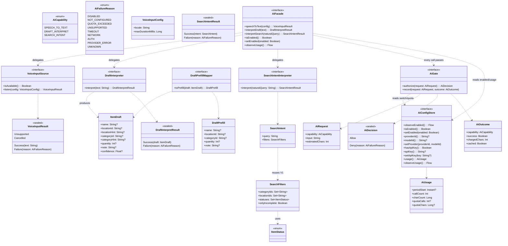
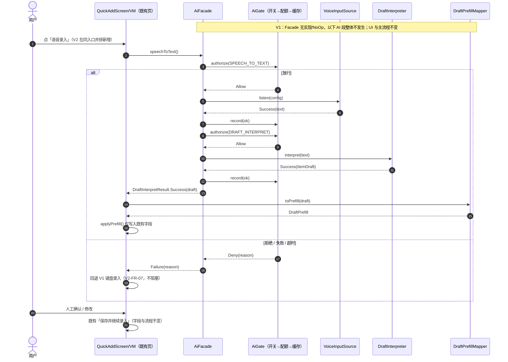
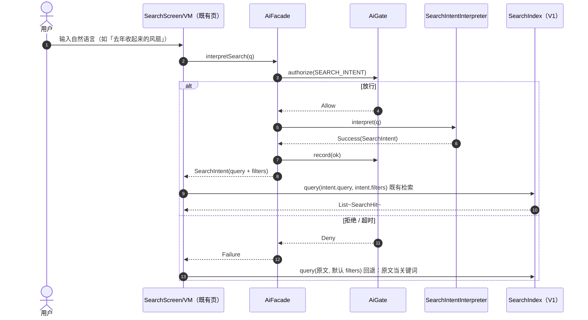

# 架构 · 13 V2 预留接口契约

> 所属：收纳助手系统设计 **v1.2** ｜ 父文档：[ARCHITECTURE.md](../ARCHITECTURE.md)
> 上游产品输入：[PRD v1.4 §14](../prd/14-分期与V2-AI规划.md)（§14.3 能力 / §14.5 六处缝 / §14.6 成本约束）
> 性质：**接口契约**——V1 只保证「缝」在，V2 才在缝里插实现
> 一句话：把 PRD §14.5 的 **V2-SEAM-01~06** 落成 `com.dream.shouna.domain.ai` 下的**纯接口与数据类型**，使 V2 接入时**不改 V1 的数据结构与主流程**。

---

## 0. 契约总原则（硬约束 · 逐条可核）

| 编号 | 原则 | 判定方式 |
|---|---|---|
| P1 | V1 只新增**纯 Kotlin 接口与数据类**；不写任何 AI 实现、不写任何网络代码 | 新增文件内无 `okhttp`/`retrofit`/`HttpURLConnection`/IP 地址等 |
| P2 | **0 新增第三方依赖 / 0 新增权限 / 0 新增页面 / 0 新增面向用户文案** | `libs.versions.toml` 无新增；`AndroidManifest.xml` 无 `uses-permission` |
| P3 | 所有 AI 能力经**唯一入口** `AiFacade`；其内部**必过** `AiGate`（开关→配额→缓存） | 全仓只有 `AiFacade` 被 UI/VM 依赖 |
| P4 | **字段零新增**：草稿/预填值只映射 V1 既有物品字段与既有检索维度 | `ItemDraft`/`DraftPrefill` 字段 ⊆ V1 物品字段 |
| P5 | V1 默认关闭、无 AI UI：`AiConfigStore.isEnabled()` 缺省 `false` | 未开启时行为与 V1 完全一致 |
| P6 | 解释器/缓存/配额/密钥存储的**具体实现**本契约**不定义**，只定边界 | 契约正文只出现签名与类型，不出现算法与存储方案 |

> **落地状态**：本契约已落盘为 `shouna/docs/arch/13-V2预留接口契约.md`（收纳助手系统设计 v1.2 新增）。文中的签名与类型为**采用稿**——V1 实现阶段按此照抄接口；**V2 实现阶段**再按 §3 各条「V2 替换改哪些文件」接入真实实现。

---

## 1. 包、路径与命名

- **包**：`com.dream.shouna.domain.ai`（纯 domain 层，**不依赖 Android 框架**；与既有 `domain.search`、`domain.model` 同级）。
- **建议源码路径**：`shouna/app/src/main/java/com/dream/shouna/domain/ai/…`。
- **命名**沿用既有约定（[08-共享知识.md §7.1](08-共享知识.md)）：接口无后缀、数据类无后缀、枚举无后缀；失败原因统一为 `AiFailureReason`；一次性结果用 `sealed interface XxxResult`。
- **唯一跨包引用**：`domain.search.SearchFilters`（**复用、不修改**，见 [04-数据结构与接口.md](04-数据结构与接口.md) 类图）。
- **DI 归属**：V2 用 Hilt `@Binds` 把接口绑到实现；**V1 不绑定**（无调用方，见 §6）。

---

## 2. 公共类型（`domain/ai/AiContracts.kt`）

所有缝共用的枚举与信封类型集中一处，避免各缝自造一套。

```kotlin
package com.dream.shouna.domain.ai

import java.time.Instant

/** V2 的能力分类。V1 仅声明。 */
enum class AiCapability { SPEECH_TO_TEXT, DRAFT_INTERPRET, SEARCH_INTENT }

/** 统一失败原因：所有能力共用（避免每个能力各写一套失败类型）。 */
enum class AiFailureReason {
    DISABLED,        // 总开关关闭（出厂默认）
    NOT_CONFIGURED,  // 未配置供应商 / 密钥
    QUOTA_EXCEEDED,  // 超配额（V2-COST-03）
    UNSUPPORTED,     // 环境不支持（如无系统语音识别）
    TIMEOUT,
    NETWORK,
    AUTH,            // 密钥无效
    PROVIDER_ERROR,
    UNKNOWN,
}

/** 一次 AI 请求（交给闸门计量）。 */
data class AiRequest(
    val capability: AiCapability,
    val input: String,
    val estimatedChars: Int = input.length,
)

/** 一次调用的结果记账（放行并执行完毕后回填）。 */
data class AiOutcome(
    val capability: AiCapability,
    val success: Boolean,
    val chargedChars: Int = 0,
    val cached: Boolean = false,
)

/** 本周期用量（V2-COST-04「成本可见」）。quota 为 null 表示不限。 */
data class AiUsage(
    val periodStart: Instant? = null,
    val callCount: Int = 0,
    val charCount: Long = 0,
    val quotaCalls: Int? = null,
    val quotaChars: Long? = null,
)
```

> `java.time.Instant` 已在 V1 由 **core library desugaring** 提供（[03-关键架构判断.md §2.11](03-关键架构判断.md)），**不新增依赖**。

---

## 3. 逐缝契约

> 每条缝给出：接口名与包路径、方法签名、入参/出参类型、**V1 最小落地形态**、**V2 替换时改哪些文件 / 明确不改哪些**。

### 3.1 SEAM-01 语音输入位（语音 → 文本）

**接口**：`com.dream.shouna.domain.ai.VoiceInputSource`
**文件**：`shouna/app/src/main/java/com/dream/shouna/domain/ai/VoiceInput.kt`

```kotlin
interface VoiceInputSource {
    /** 当前设备/环境是否具备语音输入能力。V1 的 NoOp 恒为 false。 */
    fun isAvailable(): Boolean
    /** 一段语音 → 文本。V2 优先用系统语音识别，不自行调云端 ASR（V2-COST-02）。 */
    suspend fun listen(config: VoiceInputConfig = VoiceInputConfig()): VoiceInputResult
}

data class VoiceInputConfig(
    val locale: String = "zh-CN",
    val maxDurationMillis: Long = 60_000L,
)

sealed interface VoiceInputResult {
    data class Success(val text: String) : VoiceInputResult
    data object Unsupported : VoiceInputResult
    data object Cancelled : VoiceInputResult
    data class Failure(val reason: AiFailureReason) : VoiceInputResult
}
```

| 项 | 内容 |
|---|---|
| 入参 | `VoiceInputConfig`（语言、时长上限） |
| 出参 | `VoiceInputResult.Success(text)` / `.Unsupported` / `.Cancelled` / `.Failure(reason)` |
| **V1 最小落地** | **只留接口 + 数据类型**（本文件）；**不写实现**、不申请 `RECORD_AUDIO`、不做录音 |
| **V2 替换改哪些文件** | 新增 1 个实现文件（如 `domain/ai/impl/SystemVoiceInputSource.kt`）+ `AndroidManifest` **加** `RECORD_AUDIO` + 在 `QuickAddScreen` **同一入口并排**加一个语音按钮 |
| **V2 不改** | `P-ADD` 的**字段集**与**保存流程**（`QuickAddViewModel.inputName` 等既有字段）、`ItemDraft` 形状 |

### 3.2 SEAM-02 文本 → 结构化草稿的解释位

**接口**：`com.dream.shouna.domain.ai.DraftInterpreter`
**文件**：`shouna/app/src/main/java/com/dream/shouna/domain/ai/DraftInterpreter.kt`

```kotlin
interface DraftInterpreter {
    /** 一段文本 → 结构化草稿。 */
    suspend fun interpret(text: String): DraftInterpretResult
}

/**
 * 结构化草稿：字段**严格沿用 V1 物品字段**（名称 / 位置 / 分类 / 数量 / 备注），各字段均可为空。
 * 只用于「人未确认前」的进程内传递，**不落库**。不新增任何物品字段。
 */
data class ItemDraft(
    val name: String? = null,
    val locationId: String? = null,     // 能映射到已有位置时才填；null 由内置「未指定位置」承接
    val locationHint: String? = null,   // 位置原文（未能映射为 ID 时保留，供人确认）
    val categoryId: String? = null,
    val categoryHint: String? = null,
    val quantity: Int? = null,
    val note: String? = null,
    val confidence: Float? = null,      // 可选，忽略不影响流程
)

sealed interface DraftInterpretResult {
    data class Success(val draft: ItemDraft) : DraftInterpretResult
    data class Failure(val reason: AiFailureReason) : DraftInterpretResult
}
```

| 项 | 内容 |
|---|---|
| 入参 | `text: String`（一句口语） |
| 出参 | `DraftInterpretResult.Success(ItemDraft)` / `.Failure(reason)` |
| **V1 最小落地** | **只留接口 + `ItemDraft`/`DraftInterpretResult`**；不做任何文本解析 |
| **V2 替换改哪些文件** | 新增 1 个实现（本地规则优先，判不出再走云端，V2-COST-02） |
| **V2 不改** | `ItemEntity` 字段集（**不新增物品字段**）、`SearchDoc`、既有落库 SQL |

> ⚠️ `locationHint`/`categoryHint` 是**草稿 DTO 的字段**（瞬态），**不是**持久化物品字段——不违反 P4/PRD §14.5「不得新增物品字段」。

### 3.3 SEAM-03 草稿的人工确认 / 修改位（复用现有页，不新增页面）

**契约点**：复用 V1 的 **P-ADD（快速录入）** 与 **P-ITEM-EDIT（物品编辑）**，**只预填既有字段**，保存流程不变。

**文件**：`shouna/app/src/main/java/com/dream/shouna/domain/ai/DraftPrefill.kt`

```kotlin
/** 预填值：与 V1 的 P-ADD / P-ITEM-EDIT 现有字段一一对应，不新增字段。 */
data class DraftPrefill(
    val name: String? = null,
    val locationId: String? = null,
    val categoryId: String? = null,
    val quantity: Int? = null,
    val note: String? = null,
)

/** 纯函数：草稿 → 预填值。V1 只声明，不被调用。 */
interface DraftPrefillMapper {
    fun toPrefill(draft: ItemDraft): DraftPrefill
}
```

**接入既有 ViewModel 的方法签名**（契约层**只约定接口与改动点**；实际改动属 **V1 实现阶段任务项**，见 §9 C-3）：

```kotlin
// QuickAddViewModel.kt（既有文件，V1 实现阶段新增 1 个方法）
fun applyPrefill(prefill: DraftPrefill) { /* 仅把值写入既有 UiState 字段：inputName / lockedLocation / selectedCategoryId / note；不触发保存 */ }

// ItemEditViewModel.kt（既有文件，V1 实现阶段新增 1 个方法）
fun applyPrefill(prefill: DraftPrefill) { /* 同上；不触发保存 */ }
```

| 项 | 内容 |
|---|---|
| 入参 | `ItemDraft`（→ `DraftPrefill`） |
| 出参 | 无（写入既有 UiState） |
| **V1 最小落地** | 1 个新文件（`DraftPrefill.kt`）+ 在 **2 个既有 VM** 各加 1 个 `applyPrefill`（各约 6 行，**属 V1 实现阶段任务项**）。V1 **不新增页面**、不动路由 |
| **V2 替换改哪些文件** | 新增 `DraftPrefillMapper` 实现；在录入/搜索入口接 `AiFacade` 产出草稿后调 `applyPrefill` |
| **V2 不改** | `P-ADD`/`P-ITEM-EDIT` 的字段集、`Routes.kt` 中 `QuickAddRoute`/`ItemEditRoute` 的签名、保存事务 |

> **草稿如何到达页面（V2 二选一，V1 不实现）**：① 复用既有 `QuickAddRoute(locationId)`，把草稿放进程内一次性交接；② 给既有路由加一个可选参数。本契约**不预设**，只约定「**不新增页面、不改字段**」。

### 3.4 SEAM-04 自然语言 → 检索条件的意图位

**接口**：`com.dream.shouna.domain.ai.SearchIntentInterpreter`
**文件**：`shouna/app/src/main/java/com/dream/shouna/domain/ai/SearchIntentInterpreter.kt`

```kotlin
import com.dream.shouna.domain.search.SearchFilters   // 复用 V1 既有类型，不修改

interface SearchIntentInterpreter {
    /** 一句自然语言 → 检索意图。只能映射到 V1 已有检索维度。 */
    suspend fun interpret(naturalQuery: String): SearchIntentResult
}

/** 检索意图：复用 V1 的 SearchFilters 与关键词，**不新增检索维度**。 */
data class SearchIntent(
    val query: String = "",
    val filters: SearchFilters = SearchFilters(),
)

sealed interface SearchIntentResult {
    data class Success(val intent: SearchIntent) : SearchIntentResult
    data class Failure(val reason: AiFailureReason) : SearchIntentResult
}
```

| 项 | 内容 |
|---|---|
| 入参 | `naturalQuery: String` |
| 出参 | `SearchIntentResult.Success(SearchIntent)` / `.Failure(reason)` |
| 映射维度 | **仅** V1 已有维度：关键词 + `SearchFilters(categoryIds, locationIds, statuses, onlyIncomplete)`（FR-22） |
| **V1 最小落地** | **只留接口 + 类型**；不做意图解析 |
| **V2 替换改哪些文件** | 新增 1 个实现；`SearchScreen` 把自然语言接到 `AiFacade.interpretSearch` 后，把 `intent.query`/`intent.filters` 交给**既有** `SearchIndex.query()` |
| **V2 不改** | `SearchFilters`（字段不变）、`SearchIndex`/`SearchScorer`、`SearchDoc`、检索结构 |

> **维度边界（已定稿，见 §9 C-1）**：SEAM-04 的意图**只映射 V1 既有检索维度**——关键词 + `SearchFilters` 的 **分类 / 位置 / 状态 / 是否待补详情**；**本契约不引入「时间范围」维度**。代价须明示：**V2 的「去年收起来的那些风扇」这类时间查询，在 V1 维度下做不了**（V1 无时间筛选维度）。PRD §14.5 的「输入/输出」举例中出现「时间范围」，属**产品举例宽于 V1 维度**，已按「收缩边界」处理；**PRD 本轮冻结，不因此修改 PRD**。

### 3.5 SEAM-05 AI 配置与密钥位

**接口**：`com.dream.shouna.domain.ai.AiConfigStore`
**文件**：`shouna/app/src/main/java/com/dream/shouna/domain/ai/AiConfigStore.kt`

```kotlin
import kotlinx.coroutines.flow.Flow

interface AiConfigStore {
    fun observeEnabled(): Flow<Boolean>
    fun isEnabled(): Boolean                 // 出厂默认 false（V2-COST-01）
    fun setEnabled(enabled: Boolean)         // 支持「一键关闭」（V2-COST-04）

    fun providerId(): String?
    fun modelId(): String?
    fun setProvider(providerId: String?, modelId: String?)

    /** 密钥：V1 不落地；V2 必须用 Keystore/EncryptedSharedPreferences，**不得写入 app_config 明文**。 */
    fun hasApiKey(): Boolean
    fun apiKey(): String?
    fun setApiKey(key: String?)

    fun usage(): AiUsage
    fun observeUsage(): Flow<AiUsage>
}

/** 非密配置键名（可复用 V1 既有 app_config KV 表；V1 只声明常量，不读写）。 */
object AiConfigKeys {
    const val ENABLED      = "ai_enabled"            // "true"/"false"；缺省视为 false
    const val PROVIDER     = "ai_provider"
    const val MODEL        = "ai_model"
    const val QUOTA_CALLS  = "ai_quota_calls"        // 空 = 不限
    const val QUOTA_CHARS  = "ai_quota_chars"
    const val USAGE_CALLS  = "ai_usage_calls"
    const val USAGE_CHARS  = "ai_usage_chars"
    const val USAGE_PERIOD = "ai_usage_period_start" // ISO-8601 UTC
    // 密钥键**不在此**：V2 用加密存储（见 apiKey 注释）
}
```

| 项 | 内容 |
|---|---|
| 入参/出参 | 见签名；`AiUsage` 见 §2 |
| **V1 最小落地** | 1 个新文件（接口 + `AiConfigKeys` 常量）。**P-SETTINGS 该节完全不出现**（连灰置入口都不给，PRD §14.5） |
| **V2 替换改哪些文件** | 新增实现（非密值走既有 `ConfigDao`/app_config；密钥走加密存储）；在 `SettingsScreen` **新增一节**（V2 才出现） |
| **V2 不改** | `P-SETTINGS` 既有各节（阈值 / 导出 / 导入 / 显示完整功能开关 / 关于）；`app_config` 表结构 |

> **密钥存储提示**：加密存储需引入 `androidx.security:security-crypto`（**V2 依赖决策**，**V1 不得引入**）。本契约只登记该边界，不选型。

### 3.6 SEAM-06 统一调用成本闸门位

**接口**：`com.dream.shouna.domain.ai.AiGate`（闸门）+ `com.dream.shouna.domain.ai.AiFacade`（唯一入口）
**文件**：`shouna/app/src/main/java/com/dream/shouna/domain/ai/AiGate.kt`、`…/AiFacade.kt`

```kotlin
/** 所有 AI 调用的唯一闸门：总开关 → 配额 → 缓存；任一不通过即回退人工。 */
interface AiGate {
    /** 放行判定。返回 Deny 时调用方**必须**走 V1 人工路径（V2-FR-07）。 */
    suspend fun authorize(request: AiRequest): AiDecision
    /** 计量回填：仅在放行且实际执行后调用（缓存命中也要记账，cached=true）。 */
    suspend fun record(request: AiRequest, outcome: AiOutcome)
}

sealed interface AiDecision {
    data object Allow : AiDecision
    data class Deny(val reason: AiFailureReason) : AiDecision
}

/**
 * **唯一 AI 入口**：UI/ViewModel 只依赖本接口，不直接依赖三个 Source/Interpreter 或 AiGate。
 * 每个方法内部都必须先过 AiGate；失败即返回 Failure，调用方回落 V1 人工路径。
 */
interface AiFacade {
    suspend fun speechToText(config: VoiceInputConfig = VoiceInputConfig()): VoiceInputResult
    suspend fun interpretDraft(text: String): DraftInterpretResult
    suspend fun interpretSearch(naturalQuery: String): SearchIntentResult
    fun isEnabled(): Boolean
    fun setEnabled(enabled: Boolean)          // 一键关闭（V2-COST-04）
    fun observeUsage(): Flow<AiUsage>
}
```

| 项 | 内容 |
|---|---|
| 入参/出参 | `AiGate.authorize(AiRequest) → AiDecision`；`record(AiRequest, AiOutcome)`；`AiFacade` 见签名 |
| 闸门顺序 | **总开关**（`AiConfigStore.isEnabled`）→ **配额**（`AiUsage` vs quota）→ **缓存**（命中即返回，不产生外部调用）→ 否则放行；任一不通过 → `Deny` → 人工回退 |
| **V1 最小落地** | 2 个新文件（`AiGate.kt` + `AiFacade.kt`，仅接口与类型）。**不实现**闸门，**不实现**缓存/配额 |
| **V2 替换改哪些文件** | 新增闸门实现 + `AiFacade` 实现（组合 Gate + 三个 Source/Interpreter + 缓存），`di/AiModule.kt` 一处 `@Binds` 绑定 |
| **V2 不改** | UI 各页对 `AiFacade` 的调用点（**触发点集中在这一处**）；既有 `SearchIndex`/`Repository`/DAO |

---

## 4. 类图（`domain.ai` 契约与 V1 复用点）



---

## 5. 调用时序（V2 接入后的形态；V1 段整体不发生）

### 5.1 语音录入链路（含失败回退）



### 5.2 自然语言检索链路（含回退）



---

## 6. V1 最小落地形态与成本

### 6.1 建议新增文件（V1 只留接口，全部位于 `domain.ai`）

| # | 文件（全局路径，源码根 = `shouna/app/src/main/java/com/dream/shouna/`） | 用途 | 缝 | 估算行数（预估） |
|---|---|---|---|---|
| 1 | `…/domain/ai/AiContracts.kt` | 公共枚举与信封（`AiCapability`/`AiFailureReason`/`AiRequest`/`AiOutcome`/`AiUsage`） | 全部 | ~60 |
| 2 | `…/domain/ai/VoiceInput.kt` | SEAM-01 接口 + `VoiceInputConfig` + `VoiceInputResult` | 01 | ~25 |
| 3 | `…/domain/ai/DraftInterpreter.kt` | SEAM-02 接口 + `ItemDraft` + `DraftInterpretResult` | 02 | ~30 |
| 4 | `…/domain/ai/DraftPrefill.kt` | SEAM-03 `DraftPrefill` + `DraftPrefillMapper` | 03 | ~20 |
| 5 | `…/domain/ai/SearchIntentInterpreter.kt` | SEAM-04 接口 + `SearchIntent` + `SearchIntentResult` | 04 | ~25 |
| 6 | `…/domain/ai/AiConfigStore.kt` | SEAM-05 接口 + `AiConfigKeys` | 05 | ~40 |
| 7 | `…/domain/ai/AiGate.kt` | SEAM-06 闸门接口 + `AiDecision` | 06 | ~20 |
| 8 | `…/domain/ai/AiFacade.kt` | SEAM-06 唯一入口接口 | 06 | ~25 |
| | **合计** | **8 个新文件（纯声明）** | | **~245** |

> 上表为**建议新增的 V1 源码文件**（属 **V1 实现阶段任务项**，本契约**只定接口**，不创建文件）；行数为**预估**（接口+数据类）。

### 6.2 V1 改动既有文件（仅 2 处，属 V1 实现阶段任务项）

| 文件 | 改动 | 量级 |
|---|---|---|
| `…/ui/screen/add/QuickAddViewModel.kt` | 新增 `applyPrefill(prefill: DraftPrefill)`（只赋值既有字段） | ~6 行 |
| `…/ui/screen/itemedit/ItemEditViewModel.kt` | 新增 `applyPrefill(prefill: DraftPrefill)` | ~6 行 |

### 6.3 逐缝成本与「只留接口可否」

| 缝 | V1 新增文件 | V1 新增行数（预估） | 新增依赖 | 新增权限 | 新增页面 | 只留接口不写实现？ |
|---|---|---|---|---|---|---|
| SEAM-01 语音 | 1（`VoiceInput.kt`）+ 公共契约 | ~25（+公共） | 0 | 0 | 0 | **可以** |
| SEAM-02 解释 | 1（`DraftInterpreter.kt`） | ~30 | 0 | 0 | 0 | **可以** |
| SEAM-03 确认/修改 | 1（`DraftPrefill.kt`）+ 改 2 个 VM | ~20（+12 改动） | 0 | 0 | 0 | **可以**（连 `applyPrefill` 都可留到 V2；加了则 V2 更省） |
| SEAM-04 意图 | 1（`SearchIntentInterpreter.kt`） | ~25 | 0 | 0 | 0 | **可以** |
| SEAM-05 配置/密钥 | 1（`AiConfigStore.kt`） | ~40 | 0 | 0 | 0 | **可以**（P-SETTINGS 该节 V1 不出现） |
| SEAM-06 闸门/入口 | 2（`AiGate.kt`+`AiFacade.kt`） | ~45 | 0 | 0 | 0 | **可以** |

> **结论**：六条缝的 V1 落地 = **8 个纯声明文件 + 2 处小改（~12 行）**，**0 第三方依赖 / 0 权限 / 0 页面 / 0 文案 / 0 网络代码**。全部**可以「只留接口不写实现」**；若希望 V2 完全不碰既有 VM，则把 SEAM-03 的 2 个 `applyPrefill` 一并在 V1 加上（成本 ~12 行）。

### 6.4 可选（不推荐 V1 做）

- `domain/ai/noop/NoOpAiImplementations.kt`（~70 行）+ `di/AiModule.kt`（~25 行）：V1 提供 NoOp 实现并在 Hilt 绑定，让调用点与依赖图一次到位。
- **不推荐在 V1 做**：V1 无任何 AI 调用方，NoOp 与 DI 绑定是**为想象力付费**；留给 V2 更省（V2 直接写真实实现 + 一处 `@Binds`）。

---

## 7. 零网络保证（呼应 NFR-01 / 02 / 17 与 PRD §14.4）

V1 落地本契约**不触碰**任何网络面：

| 项 | V1 状态 |
|---|---|
| `AndroidManifest.xml` 权限 | **仍为 0 个 `uses-permission`**（含无 `INTERNET`、无 `RECORD_AUDIO`） |
| `libs.versions.toml` | **无新增**（无网络库、无 AI SDK、无加密库） |
| `domain.ai` 新增代码 | **纯 Kotlin 声明**：只有 `interface` / `data class` / `enum` / `sealed interface`，**无方法体、无 I/O** |
| 运行时行为 | 未开启（`isEnabled()==false` 缺省）→ 与 V1 完全一致 |
| R8 | 无调用方的接口/数据类可被裁剪，**对包体积≈0** |

> V2 一旦走**路线乙（云端 AI）**，将**推翻** NFR-01/02/17 的「零网络」承诺——该冲突已由产品登记为「V2 阶段需重新评估项」（PRD §14.4 / [10-非功能需求.md §9.3](prd/10-非功能需求.md)），**不在本契约内裁定**；本契约只保证 V1 不引入网络面。

---

## 8. 与已知落差 / 未决项的关系

### 8.1 架构文档 vs PRD 落差（PRD [05 §4.8](prd/05-需求池.md) 登记，本轮**不改**）

| 落差点 | 影响本契约吗 | 说明 | 建议处理时机 |
|---|---|---|---|
| 路由 **11 → 8** | **是（低）** | SEAM-03 复用目标 `P-ADD` / `P-ITEM-EDIT` 在 8 个页面中**仍在**；`QuickAddRoute`/`ItemEditRoute` 签名不变。本契约按 v1.3 页面清单表述，**不引用已删路由**（`OnboardingRoute`、独立 `BackupRoute` 等） | PRD 定稿、实现前，由架构师同步 `arch/03 §2.6` 路由表与 `arch/06` 文件列表 |
| 统计卡片 **7 → 3** | **否** | 本契约不含「统计」缝 | 与 `arch/04`、`arch/09` 同批对齐 |
| `ItemStatus` **五态 → 三态** | **是（中）** | 影响 SEAM-04 的 `filters.statuses` **取值集合**（以及 SEAM-02 若含状态）；本契约**只引用 `ItemStatus` 抽象，不绑定具体 code**，故接口形状不受影响 | 与 PRD [08 §7.1](prd/08-数据字段业务语义.md)「3 态枚举名与取值待架构师确认」**同批裁定**（实现前）；本契约不阻塞 |
| `onboard` 目录取消 | **否** | 本契约不涉及引导 | 与 `arch/06`、`arch/11` 同批清理 |

> 另：`ARCHITECTURE.md` 停在 **v1.2**、`arch/*` 停在 **v1.1**、PRD 已到 **v1.4**。本契约落盘时为**与父文档当前版本号一致**，头部「所属」写 `v1.2`；**未自行升版、未改 `ARCHITECTURE.md` 版本变更表**（是否升版留作报告项）。

### 8.2 数据模型归属未决（`一物一处` vs `多对多 Placement`，PRD [08 §7.3](prd/08-数据字段业务语义.md) 待裁定）

本契约**不裁决**该冲突，只标注依赖——**两种模型下本契约的接口形状一致**：

| 维度 | 模型甲：`item.locationId` 单一归属（[arch/01](01-结论速览.md) v1.2） | 模型乙：`Placement` 多对多（[arch/03 §2.2](03-关键架构判断.md) / [arch/04](04-数据结构与接口.md) v1.1） |
|---|---|---|
| SEAM-02 草稿的 `locationId` | 直写 `item.locationId`；`null` → 内置「未指定位置」承接 `NOT NULL` | 落 1 条 `Placement`（可 `isPrimary`）；`null` → 内置「未指定位置」为主 |
| SEAM-04 的 `filters.locationIds` | 位置 → 单列匹配 | 位置 → 关联行匹配（照 `placement.locationId`） |
| 契约接口差异 | **无** | **无** |
| 差异落在何处 | V1 既有落库/查询实现（**不在本契约范围**） | 同左 |

> **结论**：本契约**不被该未决项阻塞**；并注明「若最终裁定为模型甲，则『位置可后补』由内置『未指定位置』承接 `NOT NULL`」。

---

## 9. 决定事项（已定稿 / 已采纳）

> 本轮由用户裁定并冻结，**无「待明确」悬空项**。区分两列：**本契约层的决定**（定义接口与边界）与 **V1 实现阶段的任务项**（落地时照做）。

| # | 事项 | 决定 | 层级 |
|---|---|---|---|
| C-1 | SEAM-04 是否引入「时间范围」维度 | **已定稿：不映射**——只映射 V1 既有检索维度（关键词 + 分类 + 位置 + 状态 + 待补详情），**不引入「时间范围」**。代价：**V2 的「去年收起来的那些风扇」这类时间查询，在 V1 维度下做不了**。PRD §14.5 举例出现「时间范围」属**产品举例宽于 V1 维度**，按「收缩边界」处理；**不改 PRD**（PRD 本轮冻结） | 本契约层的决定 |
| C-2 | V1 是否声明 `AiConfigKeys` 常量 | **已采纳：声明**——纯字符串常量、0 依赖，避免 V2 自造键名导致两套口径 | 本契约层的决定（V1 落地） |
| C-3 | SEAM-03 的 `applyPrefill` 是否 V1 就加 | **已采纳：V1 加**——契约层只约定方法与改动点；**实际改动 2 个 ViewModel（各约 6 行）属 V1 实现阶段任务项** | 实现阶段任务项 |
| C-4 | V1 是否加 NoOp 实现 + `di/AiModule.kt` | **已采纳：不加**——V1 无调用方，避免为想象力付费；V2 直接写真实实现 + 一处 `@Binds` | 本契约层的决定 |
| C-5 | `ItemStatus` 三态 code 命名 | **已采纳：本契约不绑定**——只引用 `ItemStatus` 抽象；具体 code 与 PRD [08 §7.1](prd/08-数据字段业务语义.md) 同批裁定（实现前对齐项） | 本契约层的决定（不绑定） |
| C-6 | 落盘位置与编号 | **已采纳：`shouna/docs/arch/13-V2预留接口契约.md`**（接续 `arch/01~12`） | 本契约层的决定 |

---

## 10. 变更记录

| 版本 | 日期 | 变更摘要 |
|---|---|---|
| **v1.2（新增）** | 2026-09-24 | 首版落盘：把 PRD v1.4 §14.5 的 V2-SEAM-01~06 落成 `domain.ai` 接口契约；C-1 定稿为「不映射时间范围」；含 V1 最小落地成本、零网络保证、架构落差与数据模型未决项标注 |
