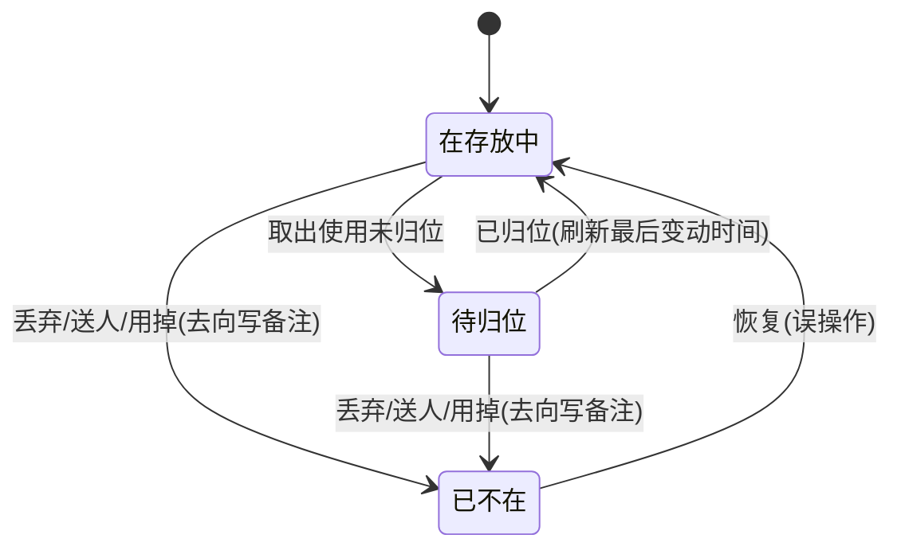

# PRD · 06 必须正面处理的难点

> 所属：收纳助手 PRD **v1.4**（2026-09-24）｜ 父文档：[PRD.md](../PRD.md)
> 本文件回答：东西该不该记、录入要多快、记录可不可信、临时放置怎么表达。
> 依赖：[05-需求池.md](05-需求池.md) ｜ 被依赖：[07-页面结构与关键交互.md](07-页面结构与关键交互.md)、[08-数据字段业务语义.md](08-数据字段业务语义.md) 引用本文件的机制编号 M-x 与物品状态机
> 本轮为 PRD v1.3 改动，跨文件同步项见 [05-需求池.md](05-需求池.md) §4.8。

---

## 5. 必须正面处理的难点

### 5.1 难点一：录入成本 —— 此类 App 的头号死因

**问题描述**：如果录一件东西要 30 秒（选位置、填分类、加标签、写备注、拍照），用户一周内必然放弃，数据一空，App 就死了。

**设计原则**：**默认路径必须能在 10 秒内完成一件；完整信息是「可选的加深」，不是「入场门票」。**

> **v1.3 分层后的新增原则**：**「位置」也不是入场门票。** 首次启动已自动预置默认位置树（家 / 卧室 / 客厅 / 厨房 / 储物间 / 阳台，见 [05-需求池.md](05-需求池.md) §4.1），录入页的位置条**已预填**，用户不点开即无感；位置**可留空**，留空则落内置「未指定位置」，事后补充。

| 机制 | 说明 | 关联需求 |
|---|---|---|
| **M1 位置默认已填，录入不强制校验位置** | 进入录入时位置条**已预填**（默认位置树的最近使用节点）；**不强制选择位置**，可留空走内置「未指定位置」后补。**已去掉「先选位置，再连续录」这个前置动作** | FR-09 / FR-10 |
| **M2 最近位置内联，不是独立入口** | 录入页顶部横排「最近使用位置」（3–5 个）是**页内内联元素**，1 次点击即切换；它不是一个需要用户再点进去的「入口」 | FR-11 |
| **M3 只填名称即可保存** | 名称是唯一必填项，**位置亦可留空**，其余全部可后补 | FR-09 |
| **M4 一键快速分类（可跳过）** | 少量内置分类 chips（本层已升为 F1，因看得懂、零解释成本），点一下算加分项，不点直接保存 | FR-12 |
| **M5 草稿箱 / 待补详情** | 信息不全的记录进「待补详情」，事后集中补，而不是录的时候强制补。**分层后归 F2，简化档不展示这个概念** | FR-13 |
| **M6 批量确认式录入** | 打开一个箱子时，可对该位置已有物品「一键确认还在」，比逐条确认省时。**分层后归 F2** | FR-28 |
| **M7 录入过程中零弹窗** | 连续录入期间不得弹出任何位置选择/分类选择对话框。**默认位置树已预置，因此也不存在「先去建树」的前置步骤** | FR-10 |

**可验证的交互目标**

| 指标 | 目标值 | 测量方式 |
|---|---|---|
| 首次录入一件（位置已预填） | ≤ 8 秒 | 手工计时 |
| 连续录入 5 件（**位置已预填**） | **≤ 40 秒** | 手工计时 |
| 连续录入单件平均耗时（熟练） | ≤ 5 秒 | `总时长/件数` |
| 完成一条记录所需的最少强制输入项 | **1 项（名称）** | 表单断言 |
| 从打开 App 到进入可录入状态 | **≤ 2 次点击** | 点击计数 |

> 📌 **口径变更（历史注 · v1.2 → v1.3）**：上表「连续录入 5 件」与「从打开 App 到进入可录入状态」两行的口径随本轮分层调整——v1.2 为「含 1 次新建位置 ≤ 40 秒」与「≤ 3 次点击」，**v1.3 改为「位置已预填 ≤ 40 秒」与「≤ 2 次点击」**。该变更**已在** [02-产品目标.md](02-产品目标.md) 的 **G-1 同步落实**，见 [05-需求池.md](05-需求池.md) §4.8。

### 5.2 难点二：「到底有没有」如何确认与表达

用户的核心焦虑不是「记录不存在」，而是「**这条记录还可不可信**」。因此每条记录必须自带**可信度信号**。

| 机制 | 说明 |
|---|---|
| **正向确认** | 「确认还在」按钮 → 刷新 `最后确认时间`（单件 / 按位置批量） |
| **时间双标记** | 同时存在两个时间：`最后确认时间`（人为确认过）与 `最后变动时间`（位置被改过），二者含义不同，不可混淆。**分层后：F1 只展示 `最后确认时间`，`最后变动时间` 下沉 F2** |
| **过期提示** | 超过阈值（默认 6 个月，可配 3/6/12）未确认，在列表与详情给出显著提示 |
| **非删除式失效** | 状态机表达「没了」：**`已不在`**。v1.3 收敛为 3 态后**不再区分「丢弃 / 送人 / 用掉」**，去向改用**备注兜底**（F1 不追问，F2 可补一句「去哪了」）；保留历史、默认不出现在常规搜索，可恢复 |
| **待归位 / 临时** | 见本文件「难点四：收纳位置的边界」 |

**状态机（物品状态）**

> **v1.3 状态收敛说明**：由 v1.2 的 **5 态**（`在存放中 / 待归位 / 已丢弃 / 已送人 / 已用掉`）收敛为 **3 态**（`在存放中 / 待归位 / 已不在`）。「不在了」的具体去向不单独建状态，改用**备注兜底**（F1 不追问，F2 可补一句「去哪了」）。
> ⚠️ **3 态落地到数据库的枚举名与取值待架构师确认**（本 PRD 只给产品语义，不定义字段类型与枚举取值）。
> 规则：状态流转**不删除记录**；`已不在` 默认从常规搜索结果中排除，但可在 F2 的统计页查回并恢复。

### 5.3 难点三：什么该记、什么不该记

**问题**：如果用户试图记录一切（牙刷、盐、纸巾），录入量巨大、维护成本爆炸，App 必被弃用。

**建议策略（产品默认口径，不面向用户展示）**

| 建议记录 ✅ | 建议不记录 ❌ | 判定口径 |
|---|---|---|
| 季节性物品（电风扇、羽绒服、加湿器） | 日常高频使用、随手可取（餐具、牙刷） | 是否「会被收起来、且下次找它要花时间」 |
| 低频、贵重或有纪念意义的物品 | 快速消耗的日用品（纸巾、洗衣液） | 是否「半年内可能完全想不起放哪」 |
| 大量、易混、易重复购买的物品（数据线、电池、胶带） | 价值极低且随处可买的物品 | 是否「买重复会造成明显浪费」 |
| 整套/整箱收纳的物品（收纳箱、行李、工具盒） | 已经有固定明显位置且不会忘的物品 | 是否「位置本身就需要被记住」 |
| 家有成员会互相询问的物品 | — | 是否「别人也会来找你问」 |

> **v1.3 说明**：上表仅为**产品默认口径**（回答「什么该记、什么不该记」），**「建议记录什么」不作为任何面向用户的提示 / 页面 / 元素出现**——不再有独立引导页，也不再在统计页显示「当前已记录 N 件…」这类文案（原 US-09 / FR-46 已删除，见 [05-需求池.md](05-需求池.md)）。

### 5.4 难点四：收纳位置的边界 —— 临时放置怎么表达

| 场景 | 表达方式 | 关联需求 |
|---|---|---|
| 东西还没归位，先随手放在沙发上 | 归入一个内置的「**待归位区**」位置，或物品状态置为 `待归位` | FR-06 / FR-25 |
| 归位后 | 移动位置到正式位置，状态回 `在存放中`，刷新 `最后变动时间` | FR-01 / FR-25 |
| 一个位置的层级不确定（到底算柜子还是箱子） | **不强制层级语义**：位置只有「名称 + 父级」，层级深浅由用户决定，UI 仅给出「建议不超过 5 层」的软提示 | FR-01 |
| 一件东西分散在多处 | **允许一件物品关联多个存放位置**，可标记某个位置为「主位置」。⚠️ **本条口径取决于架构裁定**（`arch/01` v1.2 写「一物一处 `item.locationId`」，`arch/03`·`arch/04` 写「多对多 Placement」），**待架构师确认** | FR-10 |
| 位置暂时不知道 | **已由「允许」升为默认行为**：允许先录物品不指定位置，归入内置「**未指定位置**」，后续补充。首次启动已自动预置默认位置树（家 / 卧室 / 客厅 / 厨房 / 储物间 / 阳台，见 [05-需求池.md](05-需求池.md) §4.1），录入页位置条**已预填**，用户不点开即无感、留空即落到「未指定位置」 | FR-09 |

**明确不做**：不内置「房间/柜子/箱子/格」四种固定类型的强约束（避免把用户卡住），但可在新建位置时提供类型标签作为**可选的视觉标记**。
