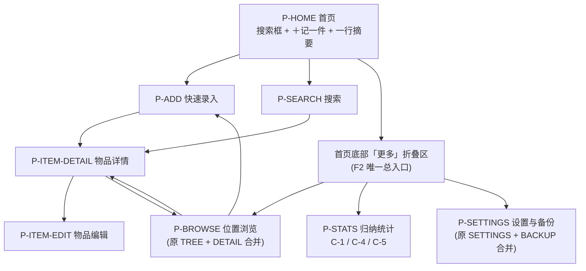

# PRD · 07 页面结构与关键交互

> 所属：收纳助手 PRD **v1.4**（2026-09-24）｜ 父文档：[PRD.md](../PRD.md)
> 本文件回答：有几个页面、怎么分层暴露、怎么跳转、每个关键页面长什么样、点一下会发生什么。
> 依赖：[05-需求池.md](05-需求池.md)、[06-必须正面处理的难点.md](06-必须正面处理的难点.md) ｜ 被依赖：[09-归纳汇总.md](09-归纳汇总.md) 的统计卡片对应本文件 P-STATS
> 本轮为 PRD v1.3 改动，跨文件同步项见 [05-需求池.md](05-需求池.md) §4.8。

---

## 6. 页面结构与关键交互

### 6.1 页面清单

| 编号 | 页面 | 职责 | 暴露层 | 优先级 |
|---|---|---|---|---|
| P-HOME | 首页 / 概览 | **4 个元素**：搜索框、＋记一件、一行摘要、折叠的「更多」 | **F1** | P0 |
| P-ADD | 快速录入 | 位置**已预填**、名称唯一必填、快速分类、保存后停留并计数 | **F1** | P0 |
| P-SEARCH | 搜索页 | 输入即搜 + 结果列表（**不含筛选**） | **F1** | P0 |
| P-ITEM-DETAIL | 物品详情 | 名称 / 位置路径 / **「还在」「不在了」两个动作** / 折叠的「⋯更多」 | **F1** | P0 |
| P-BROWSE | 位置浏览 | 树形浏览、该位置物品、批量确认、批量录入入口、位置增删改**（原 P-LOC-TREE + P-LOC-DETAIL 合并）** | **F2** | P1 |
| P-STATS | 归纳统计 | **3 张卡片**（C-1 / C-4 / C-5）+ 下钻明细 | **F2** | P1 |
| P-ITEM-EDIT | 物品编辑 | 补全分类、标签、备注、别名、数量、去向备注 | **F2** | P1 |
| P-SETTINGS | 设置与备份 | 阈值、**导出备份（置顶）**、导入恢复、「显示完整功能」开关、隐私说明、关于**（原 P-SETTINGS + P-BACKUP 合并）** | **F2** | P1 |

> **v1.3 页面清单变化**：**11 行 → 8 行**。
> ① **删除 P-ONBOARD 首次使用引导**（对应 FR-46 删除：分层后 F1 自解释，引导本身就是额外学习成本）；
> ② **P-LOC-TREE + P-LOC-DETAIL 合并为 P-BROWSE**（树与其详情本来就是同一件事的两半）；
> ③ **P-SETTINGS + P-BACKUP 合并为 P-SETTINGS**（备份只是设置页里最显眼的一块，不值得单开一页）。
> ④ F3（后台自动：拼音检索 / 本地持久化 / 失效过滤 / 删除保护 / 深色与字号跟随）**不占任何页面**。

> **v1.4 补注（V2 预留，不占本期 UI）**：V2 的 AI 草稿**确认 / 修改位拟复用本清单已有的 P-ADD（快速录入）与 P-ITEM-EDIT（物品编辑）**——V2 只是把 AI 草稿**预填**进这两个页面，再等用户点「保存」，因此**本页清单不需要为 V2 新增任何页面**。另：V2 的 **AI 设置节拟挂在 P-SETTINGS（设置与备份）页内**，**V1 完全不出现**（连灰置入口都不给）。预留位定义见 [14-分期与V2-AI规划.md](14-分期与V2-AI规划.md) 的 `V2-SEAM-03` / `V2-SEAM-05`。

### 6.2 页面跳转关系



> **「更多」的行为说明**：它**不是一个页面**，而是 P-HOME 底部的**就地折叠区**，展开后就地列出 F2 的三个入口（位置浏览 / 归纳统计 / 设置与备份），不产生新的返回栈层级；F2 页面的返回一律回到 P-HOME。它是**F2 的唯一总入口**，因此用户全程不需要理解「我现在在哪个档位」。
> **返回逻辑**：除 P-ADD 在「连续录入」中保存后停留在原页外，其余页面均为标准返回栈行为。

### 6.3 关键页面线框与交互

#### P-HOME 首页 / 概览

```
┌─────────────────────────────────┐
│  收纳助手                    ⚙  │
├─────────────────────────────────┤
│  🔍 搜索物品 / 位置 / 分类…      │  ← 元素① 点击整条 → P-SEARCH（直接聚焦输入）
├─────────────────────────────────┤
│          [ ＋ 记一件 ]           │  ← 元素② 主按钮 → P-ADD（位置已预填）
├─────────────────────────────────┤
│  共 218 件物品 · 36 个位置       │  ← 元素③ 一行摘要 → P-STATS
├─────────────────────────────────┤
│  ⋯ 更多                       ▾ │  ← 元素④ 折叠区，F2 唯一总入口（展开见下）
└─────────────────────────────────┘
```

展开「更多」后：

```
┌─────────────────────────────────┐
│  ⋯ 更多                       ▴ │
│  · 位置浏览                   › │  ← → P-BROWSE
│  · 归纳统计                   › │  ← → P-STATS
│  · 设置与备份                 › │  ← → P-SETTINGS
└─────────────────────────────────┘
```

**交互路径**：点搜索条 → 进入搜索页且键盘自动弹出；点「＋ 记一件」→ 进录入页，位置条已预填最近使用位置（从未录入过则预填「家 › 未指定位置」）；点摘要行 → 进统计页；点「更多」→ 就地展开 F2 入口。

> **v1.3 变化**：由原 **7 行内容压缩为 4 个元素**；**原「需要关注」3 行待办明细（待归位 / 待补详情 / 超期未确认）整块删除**；原「最近位置」块与「快捷操作」块取消（最近位置并入录入页内联元素，快捷操作由「＋ 记一件」与「更多」取代）。

#### P-ADD 快速录入（核心页，必须最顺手）

```
┌─────────────────────────────────┐
│  ← 记一件                    ⋯  │  ← ⋯ → F2（走完整位置树 / 分类管理）
├─────────────────────────────────┤
│  位置：家 › 未指定位置        ▾  │  ← 已预填，不点开即无感；点开才切换
│  最近： [储物间·货架A][衣柜顶层] │  ← 页内内联元素，1 次点击切换
├─────────────────────────────────┤
│  [ 物品名称（唯一必填）      ]   │  ← 自动聚焦
│  分类：[电器][衣物][工具][其他]  │  ← 可选 chips，可跳过
│  可选：备注 ›                    │  ← 折叠，默认收起（点开才见）
├─────────────────────────────────┤
│         [ 保存并继续录入 ]       │  ← 保存后清空 + 保持焦点
│         已连续录入 4 件          │
└─────────────────────────────────┘
```

**交互路径**：输入名称 → 点「保存并继续录入」或键盘回车 → 记录入库（位置 = 位置条当前值；**留空则落内置「未指定位置」，不报错、不拦截**）→ 输入框清空、焦点保持、计数 +1；期间**不得弹出任何位置/分类对话框**。

> **v1.3 变化**：位置由「进入录入后先锁定位置」改为**位置条已预填、可留空**；「最近位置」由独立入口降为**页内内联元素**；**别名 / 数量下沉 F2 的 P-ITEM-EDIT；F1 录入页保留「备注」一项可选字段（折叠，默认收起）**。

#### P-SEARCH 搜索页

```
┌─────────────────────────────────┐
│  ←  [ 电风扇          ✕ ]        │  ← 输入即搜（无按钮）
├─────────────────────────────────┤
│  电风扇                          │
│  储物间 › 货架A › 纸箱-07        │
│  3个月前确认过                   │  ← 关键词高亮
│  ─────────────────────────────   │
│  手持小风扇                      │
│  卧室 › 衣柜 › 顶层              │
│  1年前确认过  ⚠                  │
└─────────────────────────────────┘
```

**交互路径**：输入任意子串 / 拼音首字母 / 全拼 → 实时出结果；点结果 → P-ITEM-DETAIL；长按结果 → 快捷菜单（确认还在 / 移动 / 标记不在了）。

> **v1.3 变化**：**筛选 chips（分类 / 位置 / 状态）已下沉 F2**，F1 搜索页只保留「输入即搜 + 结果列表」；结果行去掉「分类 · 在存放中」后缀，只留**名称 + 完整路径 + 最后确认时间**。

#### P-ITEM-DETAIL 物品详情

```
┌─────────────────────────────────┐
│  ← 电风扇                    ✏  │  ← ✏ → P-ITEM-EDIT（F2）
├─────────────────────────────────┤
│  位置   储物间 › 货架A › 纸箱-07 │  ← 长按复制路径
├─────────────────────────────────┤
│     [ ✓ 还在 ]   [ ✕ 不在了 ]    │  ← 两个大按钮，取代 5 态下拉
├─────────────────────────────────┤
│  ⏱ 最后确认：3 个月前            │  ← F1 只展示这一个时间
├─────────────────────────────────┤
│  ⋯ 更多                       ▾ │  ← 折叠区，展开见下（→ F2）
└─────────────────────────────────┘
```

展开「⋯ 更多」后：

```
   · 分类 / 别名 / 备注 / 数量
   · 最后变动：3 个月前
   · 待归位 / 移动到其它位置
   · 不在了的去向备注（补一句「去哪了」）
```

**交互路径**：点「还在」→ 刷新 `最后确认时间`（FR-26）；点「不在了」→ 状态置 `已不在`，**F1 不追问去向**，此后该物品默认从常规搜索中隐藏（FR-25）；点「⋯ 更多」→ 就地展开 F2 字段。

> **v1.3 变化**：由「5 态下拉 + 双时间并排」改为「**两个大按钮 + 单一时间 + 一条折叠更多**」；「最后变动时间」「待归位」「移动位置」「分类 / 别名 / 备注 / 数量」全部下沉 F2。

#### P-STATS 归纳统计

```
┌─────────────────────────────────┐
│  ← 归纳统计                      │
├─────────────────────────────────┤
│  ┌────────┐ ┌────────┐          │
│  │物品 218│ │位置 36 │          │  ← 卡片1 C-1 总览
│  └────────┘ └────────┘          │
│  ┌───────────────────────────┐  │
│  │ 超期未确认 12 件 ›        │  │  ← 卡片2 C-4，可下钻并逐条确认
│  └───────────────────────────┘  │
│  ┌───────────────────────────┐  │
│  │ 待归位 3 件 ›             │  │  ← 卡片3 C-5，可下钻逐条归位
│  └───────────────────────────┘  │
└─────────────────────────────────┘
```

> **v1.3 变化**：卡片由 4 张（原「总览 / 分类分布 / 位置件数 Top5 / 超期未确认」）收敛为 **3 张**（C-1 / C-4 / C-5），与 [09-归纳汇总.md](09-归纳汇总.md) 严格对齐；C-2 分类分布、C-3 位置件数、C-6 已失效物品、C-7 待补详情**顺延下一期，本页不展示**。
