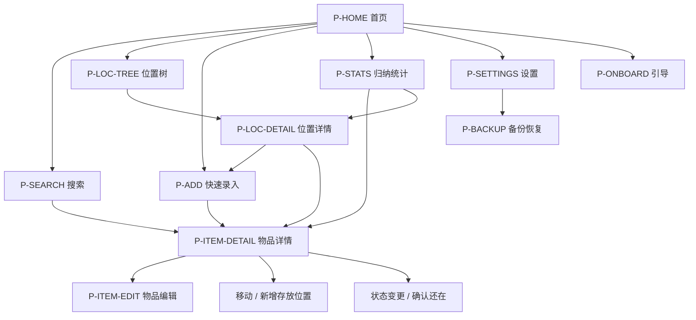

# PRD · 07 页面结构与关键交互

> 所属：收纳助手 PRD v1.2 ｜ 父文档：[PRD.md](../PRD.md)
> 本文件回答：有几个页面、怎么跳转、每个关键页面长什么样、点一下会发生什么。
> 依赖：[05-需求池.md](05-需求池.md)、[06-必须正面处理的难点.md](06-必须正面处理的难点.md) ｜ 被依赖：[09-归纳汇总.md](09-归纳汇总.md) 的统计卡片对应本文件 P-STATS

---

## 6. 页面结构与关键交互

### 6.1 页面清单

| 编号 | 页面 | 职责 | 优先级 |
|---|---|---|---|
| P-HOME | 首页 / 概览 | 搜索入口、最近位置、待归位、待补详情、统计摘要 | P0 |
| P-SEARCH | 搜索页 | 关键字检索 + 筛选 + 结果列表 | P0 |
| P-LOC-TREE | 位置树浏览页 | 树形浏览、新增/重命名位置 | P0 |
| P-LOC-DETAIL | 位置详情页 | 该位置直属物品、子位置、批量确认、批量录入入口 | P0 |
| P-ADD | 快速录入页 | 连续录入、最近位置、快速分类 | P0 |
| P-ITEM-DETAIL | 物品详情页 | 名称/位置路径/状态/两个时间/确认/移动/状态变更 | P0 |
| P-ITEM-EDIT | 物品编辑页 | 补全分类、标签、备注、别名、数量 | P1 |
| P-STATS | 归纳统计页 | 统计卡片 + 下钻明细 | P0（总览）/ P1（其余卡片） |
| P-SETTINGS | 设置页 | 阈值、备份导入导出、隐私说明、关于 | P1 |
| P-BACKUP | 备份/恢复页 | 导出、导入、冲突策略说明 | P1 |
| P-ONBOARD | 首次使用引导 | 3 步讲清核心概念 + 「建议记录什么」 | P1 |

### 6.2 页面跳转关系



> 返回逻辑：除 P-ADD 在「连续录入」中保存后停留在原页外，其余页面均为标准返回栈行为。

### 6.3 关键页面线框与交互

#### P-HOME 首页 / 概览

```
┌─────────────────────────────────┐
│  收纳助手                    ⚙  │
├─────────────────────────────────┤
│  🔍 搜索物品 / 位置 / 分类…      │  ← 点击整条 → P-SEARCH（直接聚焦输入）
├─────────────────────────────────┤
│  最近位置                        │
│  [储物间·货架A] [衣柜·顶层] [床底]│  ← 点击 → P-LOC-DETAIL
├─────────────────────────────────┤
│  快捷操作                        │
│  [＋ 快速录入]  [🗂 位置树]       │  ← ＋→P-ADD（默认最近位置）；🗂→P-LOC-TREE
├─────────────────────────────────┤
│  需要关注                        │
│  · 待归位  3 件            ›    │  ← → P-STATS 待归位清单
│  · 待补详情 7 件           ›    │  ← → P-STATS 待补清单
│  · 超期未确认 12 件        ›    │  ← → P-STATS 超期清单
├─────────────────────────────────┤
│  共 218 件物品 · 36 个位置       │  ← → P-STATS
└─────────────────────────────────┘
```
**交互路径**：点搜索条 → 进入搜索页且键盘自动弹出；点「＋」→ 进录入页并预选最近使用位置（若无可选则进位置选择）；点「需要关注」任一条 → 进统计页并定位到对应清单。

#### P-LOC-TREE 位置树浏览

```
┌─────────────────────────────────┐
│  ← 位置                      ＋  │  ← ＋新建位置（可指定父级）
├─────────────────────────────────┤
│  ▾ 家                            │
│    ▾ 卧室                        │
│      ▸ 衣柜            12 件     │
│      ▸ 床头柜           4 件     │
│    ▾ 储物间                      │
│      ▸ 货架A           31 件     │
│      ▸ 纸箱-07         18 件     │
│    ▸ 待归位区（临时）    3 件 ⚠  │  ← 临时位置高亮
└─────────────────────────────────┘
```
**交互路径**：点节点名 → P-LOC-DETAIL；点「▸」展开/收起；长按节点 → 菜单（重命名 / 新建子位置 / 移动 / 删除）。

#### P-LOC-DETAIL 位置详情

```
┌─────────────────────────────────┐
│  ← 储物间 › 货架A › 纸箱-07   ⋮  │  ← 面包屑可点逐级回退；⋮=更多
├─────────────────────────────────┤
│  本层 18 件 · 含子层 18 件       │
│  [✓ 全部确认还在]  [＋ 连续录入]  │  ← 批量确认 / 直接在该位置录入
├─────────────────────────────────┤
│  ▸ 电风扇   3个月前确认过    ⚠   │  ← 点击 → P-ITEM-DETAIL
│  ▸ 加湿器   3个月前确认过        │
│  ▸ 数据线   ⚠ 8个月未确认        │
│  ▸ 未命名…  待补详情             │
├─────────────────────────────────┤
│  子位置： 顶层 / 底层            │
└─────────────────────────────────┘
```
**交互路径**：点「全部确认还在」→ 弹出确认 → 刷新该位置所有物品的 `最后确认时间`；点「＋连续录入」→ 进 P-ADD 且位置已锁定；点物品 → P-ITEM-DETAIL。

#### P-SEARCH 搜索页

```
┌─────────────────────────────────┐
│  ←  [ 电风扇          ✕ ]        │  ← 输入即搜（无按钮）
├─────────────────────────────────┤
│  [分类 ▾][位置 ▾][状态 ▾] 清空   │  ← 筛选 chips
├─────────────────────────────────┤
│  电风扇                          │
│  储物间 › 货架A › 纸箱-07        │
│  3个月前确认过 · 电器 · 在存放中  │  ← 关键词高亮
│  ─────────────────────────────   │
│  手持小风扇                      │
│  卧室 › 衣柜 › 顶层              │
│  1年前确认过  ⚠                  │
└─────────────────────────────────┘
```
**交互路径**：输入任意子串 / 拼音首字母 / 全拼 → 实时出结果；点结果 → P-ITEM-DETAIL；长按结果 → 快捷菜单（确认还在 / 移动 / 标记失效）。

#### P-ADD 快速录入（核心页，必须最顺手）

```
┌─────────────────────────────────┐
│  ← 录入到：纸箱-07  ▾            │  ← 位置可点开切换；默认为最近使用
├─────────────────────────────────┤
│  最近： [货架A][衣柜顶层][床底]   │  ← 一键切换位置
├─────────────────────────────────┤
│  [ 物品名称（必填）        ]     │  ← 唯一必填，自动聚焦
│  分类：[电器][衣物][工具][其他]   │  ← 可选 chips，可跳过
├─────────────────────────────────┤
│         [ 保存并继续录入 ]        │  ← 保存后清空+保持焦点
│         已连续录入 4 件           │
├─────────────────────────────────┤
│  可选：别名 / 备注 / 数量 ›       │  ← 折叠，展开才显示
└─────────────────────────────────┘
```
**交互路径**：输入名称 → 点「保存并继续录入」或键盘回车 → 记录入库（位置=当前锁定位置）→ 输入框清空、焦点保持、计数 +1；期间**不得弹出任何位置/分类对话框**。

#### P-ITEM-DETAIL 物品详情

```
┌─────────────────────────────────┐
│  ← 电风扇                    ✏  │  ← ✏ → P-ITEM-EDIT
├─────────────────────────────────┤
│  位置   储物间 › 货架A › 纸箱-07 │  ← 长按复制路径
│          [移动位置]  [＋新增位置]│
├─────────────────────────────────┤
│  状态   在存放中  ▾              │  ← 可切 待归位/已丢弃/已送人/已用掉
│  数量   1                        │
│  分类   电器                     │
├─────────────────────────────────┤
│  ⏱ 最后确认：3 个月前 [确认还在] │  ← 1 次点击刷新
│  🔄 最后变动：3 个月前           │
├─────────────────────────────────┤
│  备注：…                         │
│  别名：风扇 / 电扇               │
└─────────────────────────────────┘
```

#### P-STATS 归纳统计

```
┌─────────────────────────────────┐
│  ← 归纳统计                      │
├─────────────────────────────────┤
│  ┌────────┐ ┌────────┐          │
│  │物品 218│ │位置 36 │          │  ← 卡片1 总览
│  └────────┘ └────────┘          │
│  ┌───────────────────────────┐  │
│  │ 分类分布（条形/饼）        │  │  ← 卡片2，可下钻
│  └───────────────────────────┘  │
│  ┌───────────────────────────┐  │
│  │ 位置件数 Top5             │  │  ← 卡片3，可下钻
│  └───────────────────────────┘  │
│  ┌───────────────────────────┐  │
│  │ 超期未确认 12 件 ›        │  │  ← 卡片4，可下钻并逐条确认
│  └───────────────────────────┘  │
└─────────────────────────────────┘
```
